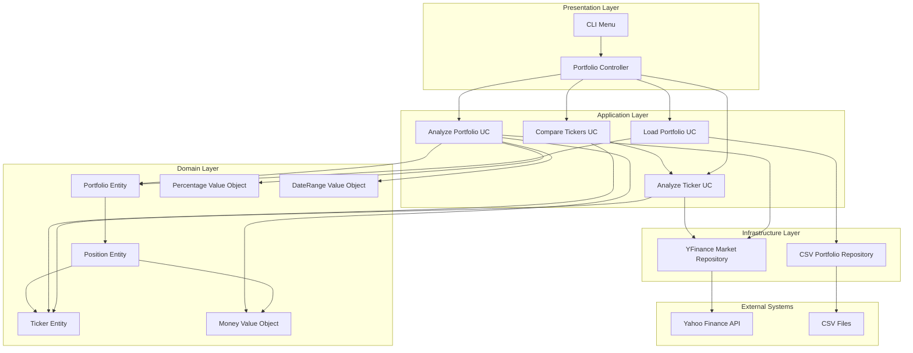
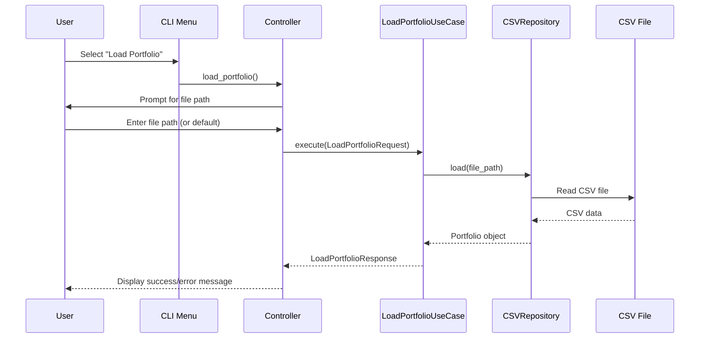
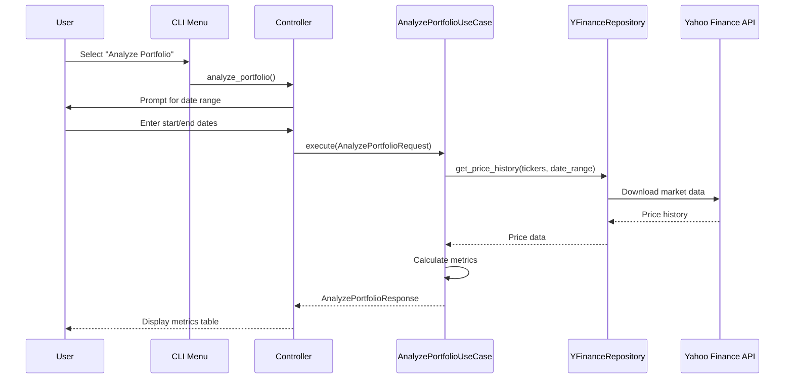

# AI.MD — Repository Technical Overview

## Table of Contents
- [1. Executive Summary](#1-executive-summary)
- [2. Tech Stack & Tooling](#2-tech-stack--tooling)
- [3. Repository Map](#3-repository-map)
- [4. Architecture Overview](#4-architecture-overview)
- [5. Services & Modules](#5-services--modules)
- [6. Data Storage & Schema](#6-data-storage--schema)
- [7. APIs & Contracts](#7-apis--contracts)
- [8. Events, Queues & Background Jobs](#8-events-queues--background-jobs)
- [9. Configuration & Secrets](#9-configuration--secrets)
- [10. Build, Run & Deploy](#10-build-run--deploy)
- [11. Observability](#11-observability)
- [12. Testing & QA](#12-testing--qa)
- [13. Performance & Scalability](#13-performance--scalability)
- [14. Security & Compliance](#14-security--compliance)
- [15. Core Flows (Sequence Diagrams)](#15-core-flows-sequence-diagrams)
- [16. LLM/AI Integration (if any)](#16-llmai-integration-if-any)
- [17. Extension Guide (How to Safely Change Things)](#17-extension-guide-how-to-safely-change-things)
- [18. Data Validation & Missing Data Detection](#18-data-validation--missing-data-detection)
- [19. Known Issues & TODOs](#19-known-issues--todos)
- [20. Glossary & Domain Concepts](#20-glossary--domain-concepts)
- [21. License & Third-Party Notices](#21-license--third-party-notices)
- [Appendix A. Module Index](#appendix-a-module-index)
- [Appendix B. Evidence Index](#appendix-b-evidence-index)

---

## 1. Executive Summary
**Purpose:**  
Investment portfolio analysis tool providing comprehensive financial metrics and risk assessment for individual stocks and portfolio aggregates.

**Owner(s)/Codeowners:**  
N/A - Personal project

**High-level function of the system in one paragraph.**  
The Portfolio Analysis Tool is a Python-based CLI application that analyzes investment portfolios using Clean Architecture principles. It loads portfolio data from CSV files, fetches real-time market data via Yahoo Finance API, and calculates comprehensive financial metrics including returns, risk ratios, volatility, and dividend analysis. The system provides both portfolio-level consolidated analysis and individual ticker analysis with interactive CLI interface.

**Entry points (CLI/Service/Workers):**  
- `main.py` - Primary CLI application entry point
- `python main.py` - Interactive menu-driven interface
Evidence: main.py:L78-L79

## 2. Tech Stack & Tooling
| Layer | Technology | Version | Where Detected | Evidence |
|------|------------|---------|----------------|----------|
| Language | Python | 3.8+ | requirements.txt, main.py | main.py:L1, requirements.txt |
| Framework | None (Pure Python) | N/A | Architecture | ARCHITECTURE.md:L1 |
| Package Manager | pip | N/A | requirements.txt | requirements.txt |
| Build/Bundle | None | N/A | Simple Python project | N/A |
| Container/IaC | None | N/A | No containerization | N/A |
| Data Processing | pandas | >=1.3.0 | requirements.txt | requirements.txt:L1 |
| Scientific Computing | numpy | >=1.20.0 | requirements.txt | requirements.txt:L2 |
| Market Data | yfinance | >=0.1.70 | requirements.txt | requirements.txt:L3 |
| Statistical Analysis | scipy | >=1.7.0 | requirements.txt | requirements.txt:L4 |
| Testing | pytest | >=6.0.0 | requirements.txt | requirements.txt:L5 |
| Configuration | pyyaml | >=5.4.0 | requirements.txt | requirements.txt:L6 |

## 3. Repository Map
**Top-level directories & roles:**  
| Path | Role | Notes | Evidence |
|------|------|------|----------|
| ./ | Root | Project root with main entry point | main.py:L1 |
| src/ | Source Code | Clean architecture implementation | ARCHITECTURE.md:L24 |
| src/domain/ | Domain Layer | Business logic and entities | ARCHITECTURE.md:L29 |
| src/application/ | Application Layer | Use cases and interfaces | ARCHITECTURE.md:L43 |
| src/infrastructure/ | Infrastructure Layer | External systems integration | ARCHITECTURE.md:L56 |
| src/presentation/ | Presentation Layer | CLI and controllers | ARCHITECTURE.md:L67 |
| tests/ | Test Suite | Unit and integration tests | ARCHITECTURE.md:L75 |
| input/ | Data Input | CSV portfolio files | input/test.csv:L1 |
| venv/ | Virtual Environment | Python dependencies | N/A |

**Notable files (entrypoints, configs, manifests):**  
- `main.py` — Application entry point with dependency injection. Evidence: main.py:L55-L79
- `requirements.txt` — Python dependencies specification. Evidence: requirements.txt:L1-L6
- `README.md` — Project documentation and usage guide. Evidence: README.md:L1
- `ARCHITECTURE.md` — Technical architecture documentation. Evidence: ARCHITECTURE.md:L1
- `CHANGELOG.md` — Version history and changes. Evidence: CHANGELOG.md:L1
- `METRICS_MEMORANDUM.md` — Financial metrics definitions. Evidence: METRICS_MEMORANDUM.md:L1

## 4. Architecture Overview
**System Diagram (Mermaid):**


**Narrative (short):**  
The system follows Clean Architecture with clear separation of concerns. The presentation layer handles user interaction through CLI, the application layer orchestrates business use cases, the domain layer contains core business logic, and the infrastructure layer manages external data sources.

**Trust boundaries & external deps:**  
- Yahoo Finance API for market data (external dependency)
- CSV files for portfolio data (local file system)
- No authentication or authorization required
Evidence: yfinance_market_repository.py:L1-L135

## 5. Services & Modules
| Name | Type (svc/lib) | Responsibilities | Key Public APIs | Depends On | Evidence |
|------|-----------------|------------------|-----------------|------------|----------|
| PortfolioController | Controller | Orchestrate user interactions, format results | load_portfolio(), analyze_portfolio(), analyze_tickers(), compare_tickers() | All use cases | portfolio_controller.py:L11-L20 |
| LoadPortfolioUseCase | Use Case | Load portfolio from CSV files | execute(LoadPortfolioRequest) | PortfolioRepository | load_portfolio.py:L16-L33 |
| AnalyzePortfolioUseCase | Use Case | Calculate portfolio-level metrics with data validation | execute(AnalyzePortfolioRequest) | MarketDataRepository | analyze_portfolio.py:L38-L86 |
| AnalyzeTickerUseCase | Use Case | Calculate individual ticker metrics with data validation | execute(AnalyzeTickerRequest) | MarketDataRepository | analyze_ticker.py:L39-L91 |
| CompareTickersUseCase | Use Case | Compare multiple tickers | execute(CompareTickersRequest) | AnalyzeTickerUseCase | compare_tickers.py:L27-L82 |
| CsvPortfolioRepository | Repository | Load/save portfolios from CSV | load(file_path), save(portfolio, file_path) | pandas | csv_portfolio_repository.py:L9-L74 |
| YFinanceMarketRepository | Repository | Fetch market data from Yahoo Finance | get_price_history(), get_current_prices(), get_dividend_history() | yfinance | yfinance_market_repository.py:L9-L134 |
| LoggerService | Service | Centralized logging management | get_logger(), log_performance(), log_user_action(), log_api_call() | logging | logger_service.py:L21-L235 |
| Portfolio | Entity | Portfolio aggregate root | get_tickers(), get_positions(), get_total_value() | Position, Ticker | portfolio.py:L6-L43 |
| Ticker | Entity | Stock ticker symbol | symbol property | None | ticker.py:L1-L27 |
| Position | Entity | Portfolio position | get_value(price) | Ticker, Money | position.py:L6-L37 |
| Money | Value Object | Monetary values with currency | __add__(), __mul__() | None | money.py:L4-L45 |
| Percentage | Value Object | Percentage calculations | to_decimal(), format() | None | percentage.py:L4-L29 |
| DateRange | Value Object | Date range handling | start, end properties | None | date_range.py:L4-L34 |

## 6. Data Storage & Schema
**Stores:** CSV Files (local file system)  
**Connection points & ORM models:**  
- CSV files via pandas DataFrame
- No database or ORM - file-based storage only

**Schema overview:**
- **Portfolio CSV Format** (input/test.csv):
  - `ticker` (string): Stock symbol (e.g., "AAPL", "BRK.B")
  - `position` (float): Number of shares/units held
  - Example: `ticker,position\nAAPL,10\nMSFT,5`

**Migrations & seeds:** N/A - File-based storage, no migrations needed  
Evidence: input/test.csv:L1-L16, csv_portfolio_repository.py:L35-L56

## 7. APIs & Contracts
**CLI Interface (Interactive Menu System)**  
For each operation, list:
- Menu Option
- Input Requirements
- Output Format
- Side effects / emitted events

| Endpoint/Operation | Method/Protocol | Request | Response | Auth | Evidence |
|---|---|---|---|---|---|
| Load Portfolio | CLI Menu Option 1 | File path (optional, defaults to input/input.csv) | Success/error message, portfolio summary | None | portfolio_controller.py:L25-L42 |
| Analyze Portfolio | CLI Menu Option 2 | Date range (start/end dates) | Portfolio metrics table | None | portfolio_controller.py:L44-L67 |
| Analyze Tickers | CLI Menu Option 3 | All tickers or specific ticker selection | Individual ticker metrics | None | portfolio_controller.py:L69-L95 |
| Compare Tickers | CLI Menu Option 4 | Date range | Ticker comparison results | None | portfolio_controller.py:L97-L125 |
| Generate Report | CLI Menu Option 5 | None | Combined portfolio and ticker analysis | None | portfolio_controller.py:L127-L143 |
| Settings | CLI Menu Option 6 | New start date or risk-free rate | Confirmation message | None | portfolio_controller.py:L145-L180 |

## 8. Events, Queues & Background Jobs
| Topic/Queue | Producer(s) | Consumer(s) | Payload (schema) | Retry/DLQ | Schedule/Cron | Evidence |
|-------------|-------------|-------------|------------------|-----------|---------------|----------|
| N/A | N/A | N/A | N/A | N/A | N/A | No event system or background jobs |

## 9. Configuration & Secrets
| Variable/Config | Purpose | Default/Example | Source (.env, config.yml) | Required? | Evidence |
|-----------------|---------|-----------------|----------------------------|-----------|----------|
| Default start date | Analysis period start | "2024-03-01" | Hardcoded in controller | No | portfolio_controller.py:L22 |
| Risk-free rate | Sharpe ratio calculation | 0.03 (3%) | Hardcoded in controller | No | portfolio_controller.py:L23 |
| Portfolio file path | CSV input file | "input/input.csv" | User input with default | No | portfolio_controller.py:L30-L32 |
| Date range | Analysis period | User input | User input | Yes | portfolio_controller.py:L182-L192 |

**Secret handling & rotation notes:**  
No secrets or sensitive data - all data is public market information  
Evidence: No authentication or secrets in codebase

## 10. Build, Run & Deploy
**Local dev:** commands to install, run, test.  
```bash
# Setup
python -m venv venv
source venv/bin/activate  # On Windows: venv\Scripts\activate
pip install -r requirements.txt

# Run
python main.py

# Test
pytest
pytest tests/unit/
pytest tests/integration/
```

**Containers & images:** N/A - No containerization  
**CI/CD:** N/A - No CI/CD pipeline configured  
Evidence: README.md:L101-L145

## 11. Observability
**Logs:** formats, levels, sinks.  
- **Comprehensive logging system** with session-based separation
- **Dual log streams**: Session-specific logs (`logs/sessions/`) and total logs (`logs/total/`)
- **Structured logging** with human-readable format
- **Log levels**: DEBUG, INFO, WARNING, ERROR, CRITICAL
- **File-based storage** with no console output (logs only go to files)
- **Detailed operation tracking**: User actions, API calls, file operations, business operations, performance metrics
- **Session management**: Timestamp-based session IDs (YYYY-MM-DD-HH-MM-SS)
- **Log management tools**: Administrative script for log cleanup and statistics

**Metrics:** key counters/gauges/histograms.  
- **Performance metrics**: Operation timing and duration tracking
- **Business metrics**: Portfolio analysis results, API call success rates
- **User interaction metrics**: Action tracking and completion times
- **Financial metrics**: Returns, volatility, Sharpe ratio, etc.

**Tracing:** N/A - No distributed tracing  
**Dashboards & alerts:** N/A - No monitoring dashboards  
Evidence: src/infrastructure/logging/logger_service.py, admin/logs_clear.py

## 12. Testing & QA
| Test Type | Where | How to Run | Coverage Hints | Evidence |
|----------|------|------------|----------------|----------|
| Unit Tests | tests/unit/ | pytest tests/unit/ | Domain entities and value objects | test_entities.py:L1-L147, test_value_objects.py:L1-L95 |
| Integration Tests | tests/integration/ | pytest tests/integration/ | End-to-end workflows | test_portfolio_analysis.py:L1-L99 |
| E2E Tests | N/A | N/A | Manual CLI testing | N/A |

**Linters/formatters:** N/A - No linter configuration found  
Evidence: 38 total tests (34 unit + 4 integration), CHANGELOG.md:L56-L59

## 13. Performance & Scalability
**Bottlenecks & hot paths:**  
- Yahoo Finance API calls (network latency)
- Large portfolio analysis (O(n) for each ticker)
- CSV file I/O operations

**Caching strategy & invalidation:**  
- No caching implemented
- Data fetched fresh on each analysis

**Load limits & SLOs/SLIs if known:**  
- No defined SLIs/SLOs
- Limited by Yahoo Finance API rate limits
Evidence: yfinance_market_repository.py:L15-L24

## 14. Security & Compliance
**Authn/z model:** None - No authentication required  
**Data classification (PII/PHI/etc.):** Public market data only  
**Supply-chain & license risks:**  
- MIT License (inferred from README)
- Dependencies: pandas, numpy, yfinance, scipy, pytest, pyyaml

**Threats & mitigations:**  
- No significant security threats (public data only)
- Input validation for CSV format and user inputs
- Error handling for external API failures
Evidence: csv_portfolio_repository.py:L35-L56, portfolio_controller.py:L160-L180

## 15. Core Flows (Sequence Diagrams)
For each major flow, provide a Mermaid sequence diagram + brief notes.

### Portfolio Loading Flow


### Portfolio Analysis Flow


Evidence: portfolio_controller.py:L25-L67, analyze_portfolio.py:L42-L86

## 16. LLM/AI Integration (if any)
| Area | Model(s) & Version(s) | Prompt Template Location | Vector DB/Index | Tokenization Settings | Guardrails | Evidence |
|------|-----------------------|--------------------------|-----------------|-----------------------|------------|----------|
| N/A | N/A | N/A | N/A | N/A | N/A | No AI/LLM integration |

## 17. Extension Guide (How to Safely Change Things)
**Where to add a new endpoint/worker/module:**  
- New use cases: Add to `src/application/use_cases/`
- New repositories: Add to `src/infrastructure/repositories/`
- New entities: Add to `src/domain/entities/`
- New value objects: Add to `src/domain/value_objects/`
- New CLI options: Add to `MainMenu` class

**Dependencies to respect:**  
- Follow Clean Architecture layers (no dependencies pointing inward)
- Use dependency injection pattern in `main.py`
- Implement repository interfaces for data access
- Follow request/response pattern for use cases

**Migration checklist:**  
1. Add new classes following existing patterns
2. Update dependency injection in `main.py`
3. Add controller methods if needed
4. Add CLI menu options
5. Write tests for new functionality
6. Update documentation

**Rollout & rollback plan:**  
- No deployment process (local development only)
- Use git for version control
- Test changes locally before committing
Evidence: ARCHITECTURE.md:L405-L422

## 18. Data Validation & Missing Data Detection

**Purpose:**  
Comprehensive data validation system that identifies and reports tickers with missing or incomplete data for accurate portfolio analysis.

**Key Features:**
- **Missing Tickers Detection**: Identifies tickers with no data available at all
- **Start Date Validation**: Detects tickers without data at analysis start date (with 5-day business tolerance)
- **User-Friendly Warnings**: Clear messages about data availability issues
- **Analysis Impact Reporting**: Shows how missing data affects analysis accuracy

**Implementation Details:**
- **Portfolio Analysis**: `AnalyzePortfolioResponse` includes `missing_tickers` and `tickers_without_start_data` fields
- **Ticker Analysis**: `AnalyzeTickerResponse` includes `has_data_at_start` and `first_available_date` fields
- **Business Day Tolerance**: 5-day tolerance accounts for weekends, holidays, and data availability delays
- **Controller Integration**: `_display_data_issues()` method shows comprehensive data availability warnings

**User Experience:**
```
⚠️  DATA AVAILABILITY ISSUES
============================================================
❌ No data available for: INVALID
   These tickers will be excluded from analysis.

⚠️  No data at start date for: TSLA, NVDA
   These tickers may have incomplete analysis periods.
   Consider adjusting your start date or excluding these tickers.
============================================================
```

**Evidence:** analyze_portfolio.py:L172-L206, analyze_ticker.py:L70-L85, portfolio_controller.py:L316-L331

## 19. Known Issues & TODOs
- No known issues documented in code
- No TODO comments found in codebase
- Potential improvements:
  - Add caching for market data
  - Implement error retry logic for API calls
  - Add configuration file support
  - Add logging framework
Evidence: No TODO comments or issue tracking found

## 20. Glossary & Domain Concepts
| Term | Meaning | Evidence |
|------|---------|----------|
| Portfolio | Collection of investment positions | portfolio.py:L6-L43 |
| Ticker | Stock symbol identifier | ticker.py:L1-L27 |
| Position | Quantity of shares held for a ticker | position.py:L6-L37 |
| Sharpe Ratio | Risk-adjusted return metric | analyze_portfolio.py:L133-L136 |
| Max Drawdown | Maximum peak-to-trough decline | analyze_portfolio.py:L138-L142 |
| VaR | Value at Risk (95% confidence) | analyze_portfolio.py:L157-L158 |
| Clean Architecture | Architectural pattern with layered dependencies | ARCHITECTURE.md:L9-L15 |
| Use Case | Business operation encapsulated in a class | load_portfolio.py:L16-L33 |
| Repository Pattern | Data access abstraction | repositories.py:L9-L36 |
| Value Object | Immutable domain concept | money.py:L4-L45 |

## 21. License & Third-Party Notices
| Package | Version | License | Obligations | Evidence |
|---------|---------|---------|-------------|----------|
| pandas | >=1.3.0 | BSD-3-Clause | Attribution required | requirements.txt:L1 |
| numpy | >=1.20.0 | BSD-3-Clause | Attribution required | requirements.txt:L2 |
| yfinance | >=0.1.70 | Apache-2.0 | Apache license notice | requirements.txt:L3 |
| scipy | >=1.7.0 | BSD-3-Clause | Attribution required | requirements.txt:L4 |
| pytest | >=6.0.0 | MIT | Minimal restrictions | requirements.txt:L5 |
| pyyaml | >=5.4.0 | MIT | Minimal restrictions | requirements.txt:L6 |

---

## Appendix A. Module Index
| Module/Path | Primary Entry Points | Key Types/Interfaces | Inbound Deps | Outbound Deps | Evidence |
|-------------|----------------------|----------------------|--------------|---------------|----------|
| main.py | main() | setup_dependencies() | sys, os | All application modules | main.py:L55-L79 |
| src/domain/entities/portfolio.py | Portfolio | get_tickers(), get_positions(), get_total_value() | Position, Ticker, Money | None | portfolio.py:L6-L43 |
| src/domain/entities/ticker.py | Ticker | symbol property | None | None | ticker.py:L1-L27 |
| src/domain/entities/position.py | Position | get_value() | Ticker, Money | None | position.py:L6-L37 |
| src/domain/value_objects/money.py | Money | __add__(), __mul__() | None | None | money.py:L4-L45 |
| src/domain/value_objects/percentage.py | Percentage | to_decimal(), format() | None | None | percentage.py:L4-L29 |
| src/domain/value_objects/date_range.py | DateRange | start, end properties | None | None | date_range.py:L4-L34 |
| src/application/use_cases/load_portfolio.py | LoadPortfolioUseCase | execute() | PortfolioRepository | Portfolio | load_portfolio.py:L16-L33 |
| src/application/use_cases/analyze_portfolio.py | AnalyzePortfolioUseCase | execute() | MarketDataRepository | Portfolio, Money, Percentage | analyze_portfolio.py:L38-L86 |
| src/application/use_cases/analyze_ticker.py | AnalyzeTickerUseCase | execute() | MarketDataRepository | Ticker, Money, Percentage | analyze_ticker.py:L39-L91 |
| src/application/use_cases/compare_tickers.py | CompareTickersUseCase | execute() | AnalyzeTickerUseCase | Ticker | compare_tickers.py:L27-L82 |
| src/application/interfaces/repositories.py | PortfolioRepository, MarketDataRepository | Abstract methods | None | Domain entities | repositories.py:L9-L36 |
| src/infrastructure/repositories/csv_portfolio_repository.py | CsvPortfolioRepository | load(), save() | pandas | Portfolio, Position, Ticker | csv_portfolio_repository.py:L9-L74 |
| src/infrastructure/repositories/yfinance_market_repository.py | YFinanceMarketRepository | get_price_history(), get_current_prices(), get_dividend_history() | yfinance | Ticker, Money, DateRange | yfinance_market_repository.py:L9-L134 |
| src/infrastructure/logging/logger_service.py | LoggerService | get_logger(), log_performance(), log_user_action(), log_api_call() | logging | All layers | logger_service.py:L21-L235 |
| admin/logs_clear.py | LogsClearManager | clear_sessions(), clear_total(), show_statistics() | os, shutil | LoggerService | logs_clear.py:L30-L255 |
| src/presentation/controllers/portfolio_controller.py | PortfolioController | All controller methods | All use cases | None | portfolio_controller.py:L11-L20 |
| src/presentation/cli/menu.py | MainMenu | show() | PortfolioController | None | menu.py:L4-L80 |

## Appendix B. Evidence Index
A flat list of all evidence lines used above for quick lookup.
- `main.py:L1` — Shebang and Python version
- `main.py:L55-L79` — Main entry point and dependency injection
- `main.py:L78-L79` — Entry point execution
- `requirements.txt:L1-L6` — Python dependencies
- `README.md:L1` — Project documentation
- `ARCHITECTURE.md:L1` — Technical architecture documentation
- `ARCHITECTURE.md:L9-L15` — Clean Architecture principles
- `ARCHITECTURE.md:L24` — Project structure
- `ARCHITECTURE.md:L29` — Domain layer
- `ARCHITECTURE.md:L43` — Application layer
- `ARCHITECTURE.md:L56` — Infrastructure layer
- `ARCHITECTURE.md:L67` — Presentation layer
- `ARCHITECTURE.md:L75` — Test suite
- `ARCHITECTURE.md:L405-L422` — Extension guide
- `CHANGELOG.md:L1` — Version history
- `CHANGELOG.md:L56-L59` — Testing information
- `METRICS_MEMORANDUM.md:L1` — Financial metrics definitions
- `input/test.csv:L1-L16` — Sample portfolio data
- `portfolio_controller.py:L11-L20` — Controller dependencies
- `portfolio_controller.py:L22-L23` — Default configuration
- `portfolio_controller.py:L25-L42` — Load portfolio operation
- `portfolio_controller.py:L44-L67` — Analyze portfolio operation
- `portfolio_controller.py:L69-L95` — Analyze tickers operation
- `portfolio_controller.py:L97-L125` — Compare tickers operation
- `portfolio_controller.py:L127-L143` — Generate report operation
- `portfolio_controller.py:L145-L180` — Settings operation
- `portfolio_controller.py:L182-L192` — Date range input
- `load_portfolio.py:L16-L33` — Load portfolio use case
- `analyze_portfolio.py:L38-L86` — Analyze portfolio use case
- `analyze_portfolio.py:L133-L136` — Sharpe ratio calculation
- `analyze_portfolio.py:L138-L142` — Max drawdown calculation
- `analyze_portfolio.py:L157-L158` — VaR calculation
- `analyze_ticker.py:L39-L91` — Analyze ticker use case
- `compare_tickers.py:L27-L82` — Compare tickers use case
- `csv_portfolio_repository.py:L9-L74` — CSV repository implementation
- `csv_portfolio_repository.py:L35-L56` — CSV validation
- `yfinance_market_repository.py:L9-L134` — Yahoo Finance repository
- `yfinance_market_repository.py:L15-L24` — API call implementation
- `portfolio.py:L6-L43` — Portfolio entity
- `ticker.py:L1-L27` — Ticker entity
- `position.py:L6-L37` — Position entity
- `money.py:L4-L45` — Money value object
- `percentage.py:L4-L29` — Percentage value object
- `date_range.py:L4-L34` — DateRange value object
- `repositories.py:L9-L36` — Repository interfaces
- `menu.py:L4-L80` — CLI menu system
- `test_entities.py:L1-L147` — Entity unit tests
- `test_value_objects.py:L1-L95` — Value object unit tests
- `test_portfolio_analysis.py:L1-L99` — Integration tests
