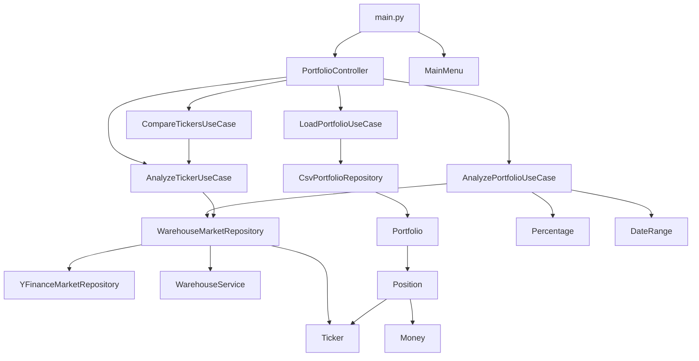
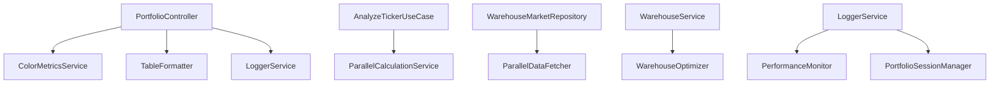
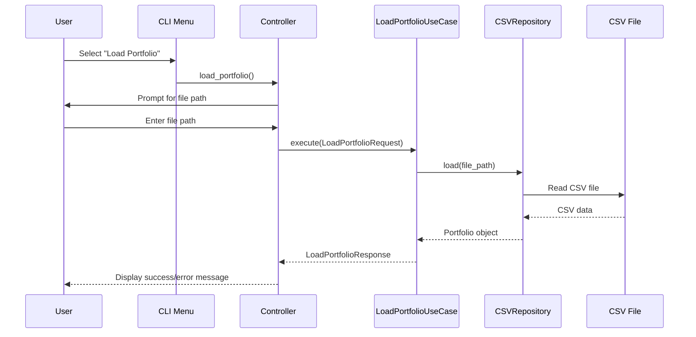
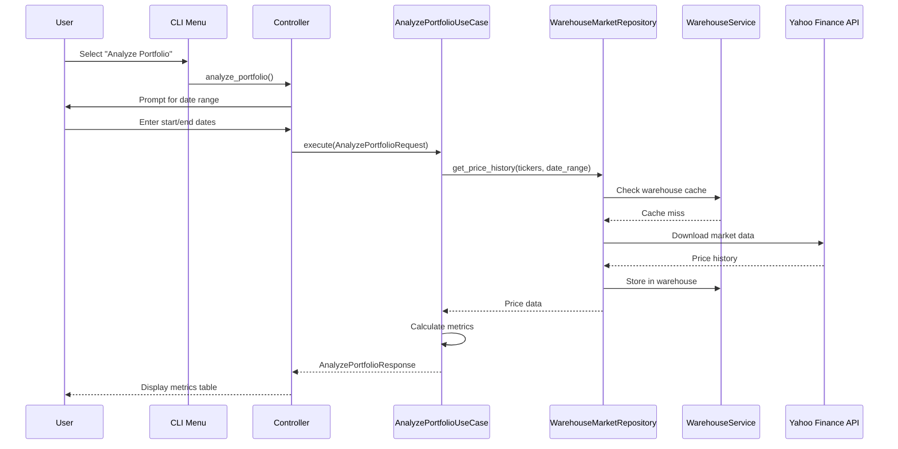
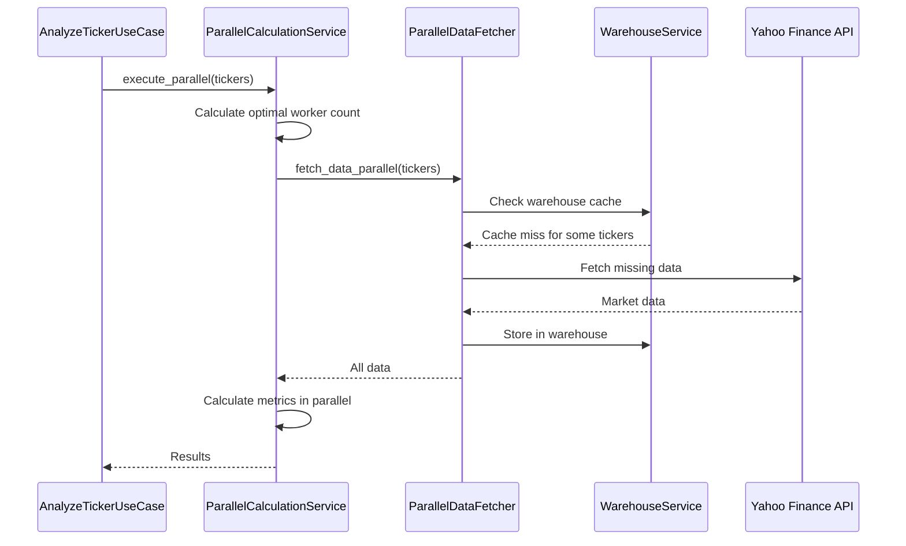

# 🔧 Backend Documentation

## Table of Contents
- [1. Overview](#1-overview)
- [2. Architecture](#2-architecture)
- [3. Dependencies & Requirements](#3-dependencies--requirements)
- [4. File Structure & Relationships](#4-file-structure--relationships)
- [5. Core Components](#5-core-components)
- [6. Data Flow](#6-data-flow)
- [7. API Endpoints](#7-api-endpoints)
- [8. Services & Utilities](#8-services--utilities)
- [9. Database & Storage](#9-database--storage)
- [10. Logging & Monitoring](#10-logging--monitoring)
- [11. Configuration](#11-configuration)
- [12. Testing](#12-testing)
- [13. Portfolio Dividend Metrics System (v4.4.7)](#13-portfolio-dividend-metrics-system-v447)
- [14. Code Quality & Performance Optimization (v4.4.5)](#14-code-quality--performance-optimization-v445)
- [15. Performance Optimizations](#15-performance-optimizations)
- [16. Error Handling](#16-error-handling)
- [17. Development Guidelines](#17-development-guidelines)

---

## 1. Overview

The backend is a Python-based portfolio analysis system built with Clean Architecture principles. It provides both CLI and REST API interfaces for portfolio analysis, market data fetching, and financial calculations.

**Key Features:**
- Portfolio analysis with comprehensive financial metrics
- Real-time market data integration via Yahoo Finance API
- SQLite warehouse system for caching and performance
- Parallel processing for multi-threaded calculations
- Comprehensive logging and monitoring
- Administration system for system management
- Centralized metrics calculator service for shared calculations
- Simplified service architecture with enhanced error handling

**Entry Points:**
- `backend/main.py` - CLI application entry point
- `backend/api.py` - FastAPI REST API server

---

## 2. Architecture

### Clean Architecture Layers

```
┌─────────────────────────────────────────┐
│           Presentation Layer            │
│  ┌─────────────┐  ┌─────────────────┐   │
│  │ CLI Menu    │  │ FastAPI Routes  │   │
│  └─────────────┘  └─────────────────┘   │
└─────────────────────────────────────────┘
┌─────────────────────────────────────────┐
│           Application Layer             │
│  ┌─────────────┐  ┌─────────────────┐   │
│  │ Use Cases   │  │ Controllers     │   │
│  └─────────────┘  └─────────────────┘   │
└─────────────────────────────────────────┘
┌─────────────────────────────────────────┐
│             Domain Layer                │
│  ┌─────────────┐  ┌─────────────────┐   │
│  │ Entities    │  │ Value Objects   │   │
│  └─────────────┘  └─────────────────┘   │
└─────────────────────────────────────────┘
┌─────────────────────────────────────────┐
│         Infrastructure Layer            │
│  ┌─────────────┐  ┌─────────────────┐   │
│  │ Repositories│  │ Services        │   │
│  └─────────────┘  └─────────────────┘   │
└─────────────────────────────────────────┘
```

### Dependency Flow
```
Presentation → Application → Domain
     ↓              ↓
Infrastructure ← Interfaces
```

---

## 3. Dependencies & Requirements

### Core Dependencies

| Package | Version | Purpose | Usage |
|---------|---------|---------|-------|
| `pandas` | >=1.3.0 | Data manipulation | CSV processing, data analysis |
| `numpy` | >=1.20.0 | Numerical computing | Financial calculations |
| `yfinance` | >=0.1.70 | Market data | Yahoo Finance API integration |
| `scipy` | >=1.7.0 | Scientific computing | Statistical calculations |
| `pytest` | >=6.0.0 | Testing framework | Unit and integration tests |
| `pyyaml` | >=5.4.0 | Configuration | YAML file parsing |
| `pytz` | >=2023.3 | Timezone handling | Date/time operations |

### FastAPI Dependencies

| Package | Purpose | Usage |
|---------|---------|-------|
| `fastapi` | Web framework | REST API server |
| `uvicorn` | ASGI server | Development server |
| `python-multipart` | File uploads | CSV file handling |
| `python-jose` | JWT tokens | Authentication (if needed) |

### Development Dependencies

| Package | Purpose | Usage |
|---------|---------|-------|
| `black` | Code formatting | Code style enforcement |
| `flake8` | Linting | Code quality checks |
| `mypy` | Type checking | Static type analysis |

---

## 4. File Structure & Relationships

### Directory Structure

```
backend/
├── main.py                          # CLI entry point
├── api.py                           # FastAPI application
├── requirements.txt                 # Python dependencies
├── src/
│   ├── domain/                      # Domain layer
│   │   ├── entities/                # Business entities
│   │   │   ├── portfolio.py         # Portfolio aggregate root
│   │   │   ├── position.py          # Position entity
│   │   │   └── ticker.py            # Ticker entity
│   │   └── value_objects/           # Immutable value types
│   │       ├── money.py             # Money value object
│   │       ├── percentage.py        # Percentage value object
│   │       └── date_range.py        # Date range value object
│   ├── application/                 # Application layer
│   │   ├── use_cases/               # Business use cases
│   │   │   ├── load_portfolio.py    # Load portfolio use case
│   │   │   ├── analyze_portfolio.py # Portfolio analysis use case
│   │   │   ├── analyze_ticker.py    # Ticker analysis use case
│   │   │   └── compare_tickers.py   # Ticker comparison use case
│   │   └── interfaces/              # Repository interfaces
│   │       └── repositories.py      # Abstract repository interfaces
│   ├── infrastructure/              # Infrastructure layer
│   │   ├── repositories/            # Data access implementations
│   │   │   ├── csv_portfolio_repository.py      # CSV file operations
│   │   │   ├── yfinance_market_repository.py    # Yahoo Finance integration
│   │   │   └── warehouse_market_repository.py   # Warehouse caching layer
│   │   ├── warehouse/               # Warehouse system
│   │   │   ├── warehouse_service.py             # SQLite operations
│   │   │   ├── trading_day_service.py           # Trading day calculations
│   │   │   └── config/
│   │   │       └── warehouse_config.py          # Warehouse configuration
│   │   ├── logging/                 # Logging system
│   │   │   ├── logger_service.py                # Centralized logging
│   │   │   ├── decorators.py                    # Logging decorators
│   │   │   ├── performance_monitor.py           # Performance monitoring
│   │   │   └── portfolio_session_manager.py     # Session management
│   │   ├── services/                # Business services
│   │   │   ├── parallel_calculation_service.py  # Multi-threaded calculations
│   │   │   ├── parallel_data_fetcher.py         # Concurrent data fetching
│   │   │   └── warehouse_optimizer.py           # Database optimization
│   │   ├── utils/                   # Utility functions
│   │   │   └── date_utils.py                    # Date validation utilities
│   │   ├── color_metrics_service.py # Color coding service
│   │   └── table_formatter.py       # Table formatting utility
│   └── presentation/                # Presentation layer
│       ├── cli/                     # Command-line interface
│       │   └── menu.py              # Interactive menu system
│       └── controllers/             # Application controllers
│           └── portfolio_controller.py # Portfolio operations controller
├── tests/                           # Test suite
│   ├── unit/                        # Unit tests
│   ├── integration/                 # Integration tests
│   └── performance/                 # Performance tests
└── admin/                           # Administrative tools
    ├── logs_clear.py                # Log management
    ├── log_search.py                # Log search utility
    └── clear_warehouse.py           # Warehouse cleanup
```

### File Relationships

#### Core Dependencies



#### Service Dependencies



---

## 5. Core Components

### Domain Layer

#### Entities

**Portfolio** (`src/domain/entities/portfolio.py`)
- **Purpose**: Aggregate root for portfolio management
- **Key Methods**:
  - `get_tickers()`: Returns list of ticker symbols
  - `get_positions()`: Returns list of positions
  - `get_total_value(prices)`: Calculates total portfolio value
- **Dependencies**: Position, Ticker

**Position** (`src/domain/entities/position.py`)
- **Purpose**: Represents a position in a portfolio
- **Key Methods**:
  - `get_value(price)`: Calculates position value
- **Dependencies**: Ticker, Money

**Ticker** (`src/domain/entities/ticker.py`)
- **Purpose**: Represents a stock ticker symbol
- **Key Methods**:
  - `symbol` property: Returns normalized ticker symbol
- **Dependencies**: None

#### Value Objects

**Money** (`src/domain/value_objects/money.py`)
- **Purpose**: Represents monetary values with currency
- **Key Methods**:
  - `__add__()`, `__mul__()`: Arithmetic operations
  - `to_decimal()`: Converts to Decimal for precision
- **Dependencies**: None

**Percentage** (`src/domain/value_objects/percentage.py`)
- **Purpose**: Represents percentage values
- **Key Methods**:
  - `to_decimal()`: Converts to decimal representation
  - `format()`: Formats for display
- **Dependencies**: None

**DateRange** (`src/domain/value_objects/date_range.py`)
- **Purpose**: Represents a period between two dates
- **Key Methods**:
  - `start`, `end` properties: Date range boundaries
- **Dependencies**: None

### Application Layer

#### Use Cases

**LoadPortfolioUseCase** (`src/application/use_cases/load_portfolio.py`)
- **Purpose**: Load portfolio from CSV files
- **Input**: `LoadPortfolioRequest` (file path)
- **Output**: `LoadPortfolioResponse` (portfolio, success, message)
- **Dependencies**: PortfolioRepository

**AnalyzePortfolioUseCase** (`src/application/use_cases/analyze_portfolio.py`)
- **Purpose**: Calculate portfolio-level metrics including dividend analysis
- **Input**: `AnalyzePortfolioRequest` (portfolio, date range, risk-free rate)
- **Output**: `AnalyzePortfolioResponse` (metrics, success, message, missing_tickers)
- **Key Features**:
  - Portfolio dividend metrics calculation
  - Position-level dividend calculations with quantity weighting
  - Annualized and total dividend yield calculations
- **Dependencies**: MarketDataRepository

**AnalyzeTickerUseCase** (`src/application/use_cases/analyze_ticker.py`)
- **Purpose**: Calculate individual ticker metrics
- **Input**: `AnalyzeTickerRequest` (ticker, date range, risk-free rate)
- **Output**: `AnalyzeTickerResponse` (metrics, success, message, has_data_at_start)
- **Dependencies**: MarketDataRepository, ParallelCalculationService

**CompareTickersUseCase** (`src/application/use_cases/compare_tickers.py`)
- **Purpose**: Compare multiple tickers
- **Input**: `CompareTickersRequest` (tickers list, date range, risk-free rate)
- **Output**: `CompareTickersResponse` (comparison, success, message)
- **Dependencies**: AnalyzeTickerUseCase

### Infrastructure Layer

#### Repositories

**CsvPortfolioRepository** (`src/infrastructure/repositories/csv_portfolio_repository.py`)
- **Purpose**: Load/save portfolios from/to CSV files
- **Key Methods**:
  - `load(file_path)`: Load portfolio from CSV
  - `save(portfolio, file_path)`: Save portfolio to CSV
- **Dependencies**: pandas, Portfolio, Position, Ticker

**YFinanceMarketRepository** (`src/infrastructure/repositories/yfinance_market_repository.py`)
- **Purpose**: Fetch market data from Yahoo Finance
- **Key Methods**:
  - `get_price_history(tickers, date_range)`: Get historical price data
  - `get_current_prices(tickers)`: Get current prices
  - `get_dividend_history(ticker, date_range)`: Get dividend history
- **Dependencies**: yfinance, Ticker, Money, DateRange

**WarehouseMarketRepository** (`src/infrastructure/repositories/warehouse_market_repository.py`)
- **Purpose**: Read-through cache decorator for market data
- **Key Methods**:
  - `get_price_history()`, `get_current_prices()`, `get_dividend_history()`
- **Dependencies**: WarehouseService, YFinanceMarketRepository

#### Services

**WarehouseService** (`src/infrastructure/warehouse/warehouse_service.py`)
- **Purpose**: SQLite database operations with WAL mode
- **Key Methods**:
  - `store_price_data()`: Store price history
  - `get_price_data()`: Retrieve price history
  - `store_dividend_data()`: Store dividend history
  - `get_dividend_data()`: Retrieve dividend history
- **Dependencies**: sqlite3, Ticker, Money, DateRange

**ParallelCalculationService** (`src/infrastructure/services/parallel_calculation_service.py`)
- **Purpose**: Multi-threaded financial calculations
- **Key Methods**:
  - `execute_parallel()`: Execute calculations in parallel
  - `get_optimal_worker_count()`: Calculate optimal worker count
- **Dependencies**: ThreadPoolExecutor, LoggerService

**ParallelDataFetcher** (`src/infrastructure/services/parallel_data_fetcher.py`)
- **Purpose**: Concurrent data fetching
- **Key Methods**:
  - `fetch_data_parallel()`: Fetch data concurrently
  - `batch_fetch()`: Batch data fetching operations
- **Dependencies**: ThreadPoolExecutor, LoggerService

**WarehouseOptimizer** (`src/infrastructure/services/warehouse_optimizer.py`)
- **Purpose**: Database optimization and connection pooling
- **Key Methods**:
  - `optimize_database()`: Optimize database performance
  - `get_connection()`: Get database connection from pool
- **Dependencies**: sqlite3, threading, queue

### Presentation Layer

#### Controllers

**PortfolioController** (`src/presentation/controllers/portfolio_controller.py`)
- **Purpose**: Orchestrates user interactions with use cases
- **Key Methods**:
  - `load_portfolio()`: Load portfolio from file
  - `analyze_portfolio()`: Analyze portfolio metrics
  - `analyze_tickers()`: Analyze individual tickers
  - `compare_tickers()`: Compare multiple tickers
- **Dependencies**: All use cases, ColorMetricsService, TableFormatter

#### CLI Interface

**MainMenu** (`src/presentation/cli/menu.py`)
- **Purpose**: Interactive command-line interface
- **Key Methods**:
  - `show()`: Display main menu
  - `handle_selection()`: Handle user input
- **Dependencies**: PortfolioController

---

## 6. Data Flow

### Portfolio Loading Flow



### Portfolio Analysis Flow



### Parallel Processing Flow



---

## 7. API Endpoints

### REST API Endpoints

| Endpoint | Method | Purpose | Request | Response |
|----------|--------|---------|---------|----------|
| `/health` | GET | Health check | None | `{"status": "healthy"}` |
| `/portfolio/upload` | POST | Upload portfolio CSV | `multipart/form-data` | `{"success": bool, "message": str}` |
| `/portfolio` | GET | Get current portfolio | None | `{"portfolio": PortfolioData}` |
| `/portfolio` | DELETE | Clear portfolio | None | `{"success": bool, "message": str}` |
| `/portfolio/analysis` | GET | Analyze portfolio | Query params | `{"metrics": PortfolioMetrics}` |
| `/portfolio/tickers/analysis` | POST | Analyze tickers | `{"tickers": List[str]}` | `{"results": List[TickerMetrics]}` |
| `/api/logs` | POST | Frontend logging | `{"logs": List[LogEntry]}` | `{"success": bool}` |

### Administration Endpoints

| Endpoint | Method | Purpose | Request | Response |
|----------|--------|---------|---------|----------|
| `/api/admin/logs/clear-all` | POST | Clear all logs | None | `{"success": bool, "message": str}` |
| `/api/admin/warehouse/clear-all` | POST | Clear warehouse | None | `{"success": bool, "message": str}` |
| `/api/admin/warehouse/stats` | GET | Get warehouse stats | None | `{"stats": WarehouseStats}` |
| `/api/admin/warehouse/tickers` | GET | Get warehouse tickers | Query params | `{"tickers": List[str]}` |
| `/api/admin/warehouse/clear-ticker` | POST | Clear ticker data | `{"ticker": str}` | `{"success": bool, "message": str}` |

---

## 8. Services & Utilities

### Logging System

**LoggerService** (`src/infrastructure/logging/logger_service.py`)
- **Purpose**: Centralized logging management
- **Features**:
  - Session-based log separation
  - Multiple log levels (DEBUG, INFO, WARNING, ERROR, CRITICAL)
  - File-based storage with no console output
  - Performance monitoring and operation tracking
- **Key Methods**:
  - `get_logger(name)`: Get logger instance
  - `log_performance(operation, duration)`: Log performance metrics
  - `log_user_action(action, details)`: Log user interactions
  - `log_api_call(endpoint, method, duration)`: Log API calls

**Logging Decorators** (`src/infrastructure/logging/decorators.py`)
- **Available Decorators**:
  - `@log_operation`: General operation logging
  - `@log_user_action`: User interaction logging
  - `@log_api_call`: External API call logging
  - `@log_file_operation`: File I/O operation logging
  - `@log_calculation`: Business calculation logging

### Color Coding System

**ColorMetricsService** (`src/infrastructure/color_metrics_service.py`)
- **Purpose**: Color-code financial metrics based on performance thresholds
- **Features**:
  - Context-aware thresholds (portfolio vs ticker metrics)
  - ANSI color support for terminal output
  - Extensible design for new metrics
- **Key Methods**:
  - `get_color_for_metric(metric, value)`: Get color code for metric
  - `colorize_percentage(value)`: Colorize percentage values
  - `colorize_ratio(value)`: Colorize ratio values

### Table Formatting

**TableFormatter** (`src/infrastructure/table_formatter.py`)
- **Purpose**: Advanced table formatting with ANSI color code handling
- **Features**:
  - ANSI code stripping for width calculations
  - Dynamic column sizing
  - Proper alignment with color codes
- **Key Methods**:
  - `create_table(headers, rows)`: Create formatted table
  - `format_table_row(row)`: Format table row
  - `strip_ansi_codes(text)`: Remove ANSI codes

### Date Utilities

**DateUtils** (`src/infrastructure/utils/date_utils.py`)
- **Purpose**: Date validation and working day calculations
- **Features**:
  - Previous working day logic for financial data consistency
  - Business day tolerance for data validation
  - Timezone support with pytz
- **Key Methods**:
  - `is_date_after_previous_working_day(date_str)`: Validate date
  - `get_previous_working_day()`: Get previous working day
  - `get_previous_working_day_string()`: Get as string

---

## 9. Database & Storage

### SQLite Warehouse Database

**Location**: `database/warehouse/warehouse.sqlite`

**Schema**:
```sql
-- Price history storage
CREATE TABLE market_data (
    ticker TEXT NOT NULL,
    date TEXT NOT NULL,
    close_price REAL NOT NULL,
    created_at TIMESTAMP DEFAULT CURRENT_TIMESTAMP,
    PRIMARY KEY (ticker, date)
);

-- Dividend payments storage
CREATE TABLE dividend_data (
    ticker TEXT NOT NULL,
    date TEXT NOT NULL,
    dividend_amount REAL NOT NULL,
    created_at TIMESTAMP DEFAULT CURRENT_TIMESTAMP,
    PRIMARY KEY (ticker, date)
);

-- Coverage tracking
CREATE TABLE dividend_coverage (
    ticker TEXT NOT NULL,
    start_date TEXT NOT NULL,
    end_date TEXT NOT NULL,
    has_dividends BOOLEAN NOT NULL,
    created_at TIMESTAMP DEFAULT CURRENT_TIMESTAMP,
    PRIMARY KEY (ticker, start_date, end_date)
);

-- Benchmark data
CREATE TABLE benchmark_data (
    ticker TEXT NOT NULL,
    date TEXT NOT NULL,
    close_price REAL NOT NULL,
    created_at TIMESTAMP DEFAULT CURRENT_TIMESTAMP,
    PRIMARY KEY (ticker, date)
);
```

**Performance Features**:
- WAL mode enabled for better concurrency
- Proper indexing on frequently queried columns
- Connection pooling for better performance
- Query caching for repeated operations

### CSV Portfolio Storage

**Format**: `ticker,position`
```csv
ticker,position
AAPL,10
MSFT,5
GOOGL,3
```

**Validation**:
- Ticker symbol format validation
- Position quantity validation (must be positive)
- Duplicate ticker handling (last wins)

---

## 10. Logging & Monitoring

### Log Structure

**Session Logs**: `logs/sessions/portfolio-{session_id}-{timestamp}.log`
**Total Logs**: `logs/total/application.log`

**Log Format**:
```
[2024-01-15 10:30:45] [INFO] [SESSION:portfolio-abc123] [OPERATION:load_portfolio] Portfolio loaded successfully: 5 positions
[2024-01-15 10:30:46] [PERFORMANCE] [DURATION:0.250s] [API_CALL:yfinance] Fetched data for AAPL
[2024-01-15 10:30:47] [ERROR] [SESSION:portfolio-abc123] [OPERATION:analyze_portfolio] Failed to fetch data for INVALID
```

### Performance Monitoring

**Metrics Tracked**:
- Operation duration and timing
- API call success/failure rates
- Database query performance
- Memory usage and resource utilization
- User action completion times

**Monitoring Tools**:
- `PerformanceMonitor` class for metrics collection
- `PortfolioSessionManager` for session tracking
- Administrative scripts for log analysis

---

## 11. Configuration

### Environment Variables

| Variable | Default | Purpose |
|----------|---------|---------|
| `PORT` | 8000 | FastAPI server port |
| `HOST` | localhost | FastAPI server host |
| `LOG_LEVEL` | INFO | Logging level |
| `WAREHOUSE_PATH` | `database/warehouse/warehouse.sqlite` | Warehouse database path |
| `MAX_WORKERS` | 4 | Maximum parallel workers |

### Configuration Files

**Warehouse Config** (`src/infrastructure/warehouse/config/warehouse_config.py`)
- Database connection settings
- Cache configuration
- Performance tuning parameters

**Logging Config** (via LoggerService)
- Log file paths and rotation
- Log level configuration
- Performance monitoring settings

---

## 12. Testing

### Test Structure

```
tests/
├── unit/                    # Unit tests (34 tests)
│   ├── test_entities.py     # Domain entity tests
│   └── test_value_objects.py # Value object tests
├── integration/             # Integration tests (4 tests)
│   └── test_portfolio_analysis.py # End-to-end workflow tests
└── performance/             # Performance tests
    └── benchmark_optimizations.py # Performance benchmarks
```

### Test Categories

**Unit Tests**:
- Domain entities and value objects
- Individual method testing
- No external dependencies
- Fast execution

**Integration Tests**:
- Use case testing with real repositories
- End-to-end workflow validation
- Limited external API calls
- Database integration testing

**Performance Tests**:
- Benchmark optimization improvements
- Load testing for parallel processing
- Memory usage profiling
- Database performance testing

### Running Tests

```bash
# Run all tests
pytest

# Run unit tests only
pytest tests/unit/

# Run integration tests only
pytest tests/integration/

# Run with coverage
pytest --cov=src tests/

# Run performance tests
pytest tests/performance/
```

---

## 13. Portfolio Dividend Metrics System (v4.4.7)

**Purpose:**  
Enhanced portfolio analysis with comprehensive dividend metrics at the portfolio level, providing complete dividend analysis alongside existing individual ticker dividend calculations.

**Key Features:**

#### Portfolio Dividend Metrics
- **Dividend Amount**: Total dividends received across all positions in the analysis period
- **Annualized Dividend Yield**: Portfolio-level annualized dividend yield based on average portfolio value
- **Total Dividend Yield**: Total dividend yield for the analysis period based on starting portfolio value
- **Position-Level Calculations**: Individual position dividend calculations with quantity weighting
- **Currency Support**: Proper currency handling for dividend amounts

#### Technical Implementation

##### PortfolioMetrics Enhancement
```python
@dataclass
class PortfolioMetrics:
    # Existing fields...
    dividend_amount: Money  # Total dividends received in period
    annualized_dividend_yield: Percentage  # Portfolio-level annualized dividend yield
    total_dividend_yield: Percentage  # Portfolio-level total dividend yield for period
```

##### API Response Enhancement
```python
# Enhanced portfolio analysis response
{
    "dividendAmount": f"${metrics.dividend_amount.amount:,.2f}",
    "annualizedDividendYield": f"{metrics.annualized_dividend_yield.value:.2f}%",
    "totalDividendYield": f"{metrics.total_dividend_yield.value:.2f}%"
}
```

##### CLI Display Enhancement
```python
# Enhanced CLI portfolio metrics display
print(f"💰 Dividend Amount:   ${metrics.dividend_amount.amount:,.2f}")
print(f"📈 Annual Div Yield:  {annualized_dividend_yield_colored}")
print(f"📊 Total Div Yield:   {total_dividend_yield_colored}")
```

#### Data Model Changes
- **PortfolioMetrics Class**: Added `dividend_amount`, `annualized_dividend_yield`, and `total_dividend_yield` fields
- **API Response**: Enhanced with dividend metrics in portfolio analysis endpoint
- **CLI Display**: Added dividend metrics to portfolio analysis output

**Benefits:**
- **Comprehensive Analysis**: Complete dividend analysis at portfolio level
- **Consistent Behavior**: Frontend and CLI now provide identical functionality
- **User Experience**: Clear separation between portfolio and ticker analysis
- **Data Completeness**: Full dividend metrics for portfolio evaluation

**Evidence:** 
- `backend/src/application/use_cases/analyze_portfolio.py` - Portfolio dividend metrics calculation
- `backend/api.py` - Enhanced API response with dividend metrics
- `backend/src/presentation/controllers/portfolio_controller.py` - CLI display enhancement

## 14. Code Quality & Performance Optimization (v4.4.5)

### Code Quality Improvements

#### Metrics Calculator Service
- **Purpose**: Centralized calculation service for shared financial metrics across use cases
- **Features**:
  - Centralized calculation logic for basic metrics, risk metrics, momentum, dividend metrics, and beta
  - Shared calculator methods across AnalyzePortfolioUseCase and AnalyzeTickerUseCase
  - Simplified service interfaces with focused responsibilities
  - Enhanced error handling and recovery mechanisms

#### Portfolio Dividend Metrics & CLI-Frontend Alignment (v4.4.7)
- **Portfolio Dividend Metrics**: Enhanced portfolio analysis with comprehensive dividend calculations
  - Dividend Amount: Total dividends received across all positions in the analysis period
  - Annualized Dividend Yield: Portfolio-level annualized dividend yield based on average portfolio value
  - Total Dividend Yield: Total dividend yield for the analysis period based on starting portfolio value
  - Position-Level Calculations: Individual position dividend calculations with quantity weighting
  - Currency Support: Proper currency handling for dividend amounts
- **CLI-Frontend Alignment (v4.4.6)**: Complete alignment between CLI and frontend
  - Portfolio Analysis Unification: Frontend portfolio analysis now matches CLI exactly
  - Individual Ticker Analysis Removal: Removed from portfolio analysis page to match CLI behavior
  - API Call Simplification: Frontend now only calls `/portfolio/analysis` endpoint
  - Message Updates: Loading and success messages updated to reflect portfolio-only analysis
  - Behavior Consistency: Frontend behavior now matches CLI "Analyze Portfolio" option exactly

#### Service Simplification
- **ParallelCalculationService**: Removed `get_optimal_worker_count` and `get_performance_metrics` methods
- **ParallelDataFetcher**: Removed `get_optimal_worker_count` and `get_performance_metrics` methods
- **WarehouseOptimizer**: Removed `get_performance_metrics` method
- **WarehouseMarketRepository**: Removed unused parallel data fetcher imports

#### Enhanced Error Handling
- **Logging Decorators**: Improved application integration and error handling
- **Service Integration**: Better error handling across all service layers
- **Error Recovery**: Enhanced error recovery mechanisms
- **Code Maintainability**: Improved code organization and maintainability

### Performance Improvements
- **Code Efficiency**: Simplified service implementations for better performance
- **Memory Usage**: Reduced memory footprint through code cleanup
- **Processing Speed**: Optimized calculation methods with shared logic
- **Error Handling**: Faster error recovery and handling

## 15. Performance Optimizations

### Parallel Processing

**ParallelCalculationService**:
- Multi-threaded financial calculations
- Dynamic worker count calculation
- Task-level error isolation
- 3-5x performance improvement for multi-ticker analysis

**ParallelDataFetcher**:
- Concurrent data fetching from external APIs
- Batch processing for multiple tickers
- 2-4x faster data retrieval
- I/O-bound task optimization

**WarehouseOptimizer**:
- Connection pooling for database operations
- Query optimization with performance indexes
- 50%+ improvement in database query performance
- WAL mode and cache optimization

### Caching Strategy

**Warehouse System**:
- Read-through caching with SQLite database
- 100x+ performance improvement for repeated requests
- Zero repeated API calls for cached data
- Trading-day aware gap filling

**Memory Management**:
- Efficient data structures for large datasets
- Resource cleanup in parallel processing
- 30%+ reduction in memory usage

---

## 16. Error Handling

### Error Strategy

**Domain Errors**:
- Business rule violations (ValueError)
- Input validation errors
- Immutable value object violations

**Application Errors**:
- Use case failures with structured responses
- Data validation errors
- Business logic violations

**Infrastructure Errors**:
- External system failures (wrapped)
- Database connection errors
- API call failures

**Presentation Errors**:
- User-friendly error messages
- Graceful degradation
- Error recovery options

### Error Flow

```
External Error → Repository → Use Case → Controller → User Message
                     ↓           ↓           ↓
                  Log Error → Structure → Format → Display
```

### Error Recovery

**Retry Mechanisms**:
- Exponential backoff for API calls
- Connection retry for database operations
- Graceful degradation for partial failures

**User Feedback**:
- Clear error messages with context
- Actionable error recovery suggestions
- Progress indicators for long operations

---

## 17. Development Guidelines

### Code Organization

**Clean Architecture Principles**:
- Dependency inversion (depend on abstractions)
- Single responsibility principle
- Open/closed principle
- Interface segregation

**Naming Conventions**:
- Classes: PascalCase (e.g., `PortfolioController`)
- Functions/Methods: snake_case (e.g., `load_portfolio`)
- Variables: snake_case (e.g., `portfolio_data`)
- Files: snake_case (e.g., `portfolio_controller.py`)

### Adding New Features

**New Use Cases**:
1. Create use case class in `src/application/use_cases/`
2. Define request/response data classes
3. Implement business logic
4. Add controller method
5. Update CLI menu if needed

**New Repositories**:
1. Implement interface in `src/application/interfaces/repositories.py`
2. Create implementation in `src/infrastructure/repositories/`
3. Update dependency injection in `main.py`
4. Add tests

**New Services**:
1. Create service class in `src/infrastructure/services/`
2. Implement required methods
3. Add logging and error handling
4. Update dependency injection
5. Add tests

### Testing Guidelines

**Unit Tests**:
- Test individual methods and classes
- Mock external dependencies
- Focus on business logic
- Fast execution

**Integration Tests**:
- Test multiple components together
- Use real repositories where possible
- Test end-to-end workflows
- Validate data flow

**Performance Tests**:
- Benchmark critical operations
- Test with large datasets
- Monitor memory usage
- Validate optimization improvements

### Code Quality

**Linting**:
- Follow PEP 8 style guidelines
- Use type hints for better code clarity
- Document public methods and classes
- Keep functions small and focused

**Error Handling**:
- Handle all possible error conditions
- Provide meaningful error messages
- Log errors with appropriate context
- Implement graceful degradation

**Performance**:
- Profile critical code paths
- Use appropriate data structures
- Implement caching where beneficial
- Monitor resource usage

---

## Conclusion

This backend documentation provides a comprehensive overview of the portfolio analysis system's architecture, components, and relationships. The system follows Clean Architecture principles with clear separation of concerns, making it maintainable and extensible.

Key strengths:
- **Modular Design**: Clear separation between layers
- **Performance**: Parallel processing and caching optimizations
- **Reliability**: Comprehensive error handling and logging
- **Testability**: Well-structured test suite
- **Extensibility**: Easy to add new features and integrations

For questions or updates to this documentation, please refer to the project's technical documentation or contact the development team.


