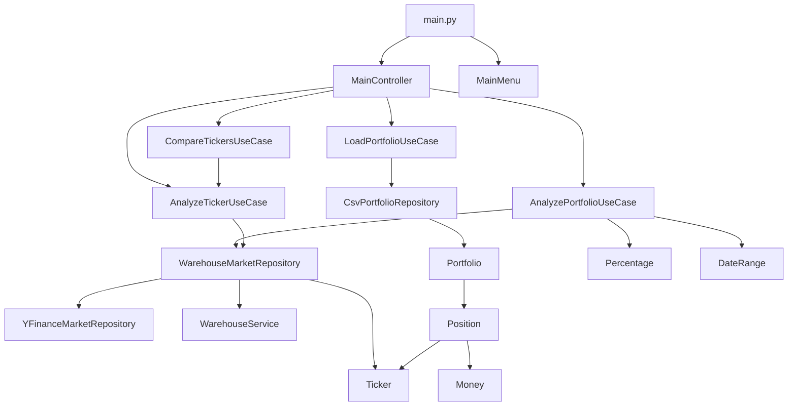
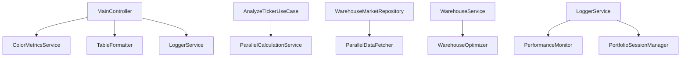

# 🔧 Backend Documentation

## Table of Contents
- [1. Overview](#1-overview)
- [2. Architecture](#2-architecture)
- [3. Dependencies & Requirements](#3-dependencies--requirements)
- [4. File Structure & Relationships](#4-file-structure--relationships)
- [5. Core Components](#5-core-components)
- [6. Data Flow](#6-data-flow)
- [7. API Endpoints](#7-api-endpoints)
- [8. Services & Utilities](#8-services--utilities)
- [9. Database & Storage](#9-database--storage)
- [10. Logging & Monitoring](#10-logging--monitoring)
- [11. Configuration](#11-configuration)
- [12. Testing](#12-testing)
- [13. Advanced Risk Metrics & Enhanced Ticker Comparison (v4.5.3)](#13-advanced-risk-metrics--enhanced-ticker-comparison-v453)
- [14. Frontend TypeScript Improvements & Code Cleanup (v4.5.2)](#14-frontend-typescript-improvements--code-cleanup-v452)
- [14. Documentation & Version Management Updates (v4.5.1)](#14-documentation--version-management-updates-v451)
- [15. Enhanced Ticker Comparison & Frontend Architecture Improvements (v4.5.0)](#15-enhanced-ticker-comparison--frontend-architecture-improvements-v450)
- [15. Portfolio Dividend Metrics System (v4.4.7)](#15-portfolio-dividend-metrics-system-v447)
- [16. Enhanced Ticker Analysis System (v4.4.8)](#16-enhanced-ticker-analysis-system-v448)
- [17. Code Quality & Performance Optimization (v4.4.5)](#17-code-quality--performance-optimization-v445)
- [18. Performance Optimizations](#18-performance-optimizations)
- [19. Error Handling](#19-error-handling)
- [20. Development Guidelines](#20-development-guidelines)

---

## 1. Overview

The backend is a Python-based portfolio analysis system built with Clean Architecture principles. It provides both CLI and REST API interfaces for portfolio analysis, market data fetching, and financial calculations.

**Key Features:**
- Portfolio analysis with comprehensive financial metrics
- Real-time market data integration via Yahoo Finance API
- SQLite warehouse system for caching and performance
- Parallel processing for multi-threaded calculations
- Comprehensive logging and monitoring
- Administration system for system management
- Centralized metrics calculator service for shared calculations
- Simplified service architecture with enhanced error handling

**Entry Points:**
- `backend/main.py` - CLI application entry point
- `backend/api.py` - FastAPI REST API server

---

## 2. Architecture

### Clean Architecture Layers

```
┌─────────────────────────────────────────┐
│           Presentation Layer            │
│  ┌─────────────┐  ┌─────────────────┐   │
│  │ CLI Menu    │  │ FastAPI Routes  │   │
│  └─────────────┘  └─────────────────┘   │
└─────────────────────────────────────────┘
┌─────────────────────────────────────────┐
│           Application Layer             │
│  ┌─────────────┐  ┌─────────────────┐   │
│  │ Use Cases   │  │ Controllers     │   │
│  └─────────────┘  └─────────────────┘   │
└─────────────────────────────────────────┘
┌─────────────────────────────────────────┐
│             Domain Layer                │
│  ┌─────────────┐  ┌─────────────────┐   │
│  │ Entities    │  │ Value Objects   │   │
│  └─────────────┘  └─────────────────┘   │
└─────────────────────────────────────────┘
┌─────────────────────────────────────────┐
│         Infrastructure Layer            │
│  ┌─────────────┐  ┌─────────────────┐   │
│  │ Repositories│  │ Services        │   │
│  └─────────────┘  └─────────────────┘   │
└─────────────────────────────────────────┘
```

### Dependency Flow
```
Presentation → Application → Domain
     ↓              ↓
Infrastructure ← Interfaces
```

---

## 3. Dependencies & Requirements

### Core Dependencies

| Package | Version | Purpose | Usage |
|---------|---------|---------|-------|
| `pandas` | >=2.3.2 | Data manipulation | CSV processing, data analysis |
| `numpy` | >=2.2.6 | Numerical computing | Financial calculations |
| `yfinance` | >=0.2.66 | Market data | Yahoo Finance API integration |
| `scipy` | >=1.7.0 | Scientific computing | Statistical calculations |
| `pytest` | >=8.4.2 | Testing framework | Unit and integration tests |
| `pyyaml` | >=5.4.0 | Configuration | YAML file parsing |
| `pytz` | >=2025.2 | Timezone handling | Date/time operations |

### FastAPI Dependencies

| Package | Purpose | Usage |
|---------|---------|-------|
| `fastapi` | Web framework | REST API server |
| `uvicorn` | ASGI server | Development server |
| `python-multipart` | File uploads | CSV file handling |
| `python-jose` | JWT tokens | Authentication (if needed) |

### Development Dependencies

| Package | Purpose | Usage |
|---------|---------|-------|
| `black` | Code formatting | Code style enforcement |
| `flake8` | Linting | Code quality checks |
| `mypy` | Type checking | Static type analysis |

---

## 4. File Structure & Relationships

### Directory Structure

```
backend/
├── main.py                          # CLI entry point
├── api.py                           # FastAPI application
├── requirements.txt                 # Python dependencies
├── src/
│   ├── domain/                      # Domain layer
│   │   ├── entities/                # Business entities
│   │   │   ├── portfolio.py         # Portfolio aggregate root
│   │   │   ├── position.py          # Position entity
│   │   │   └── ticker.py            # Ticker entity
│   │   └── value_objects/           # Immutable value types
│   │       ├── money.py             # Money value object
│   │       ├── percentage.py        # Percentage value object
│   │       └── date_range.py        # Date range value object
│   ├── application/                 # Application layer
│   │   ├── use_cases/               # Business use cases
│   │   │   ├── load_portfolio.py    # Load portfolio use case
│   │   │   ├── analyze_portfolio.py # Portfolio analysis use case
│   │   │   ├── analyze_ticker.py    # Ticker analysis use case
│   │   │   └── compare_tickers.py   # Ticker comparison use case
│   │   └── interfaces/              # Repository interfaces
│   │       └── repositories.py      # Abstract repository interfaces
│   ├── infrastructure/              # Infrastructure layer
│   │   ├── repositories/            # Data access implementations
│   │   │   ├── csv_portfolio_repository.py      # CSV file operations
│   │   │   ├── yfinance_market_repository.py    # Yahoo Finance integration
│   │   │   └── warehouse_market_repository.py   # Warehouse caching layer
│   │   ├── warehouse/               # Warehouse system
│   │   │   ├── warehouse_service.py             # SQLite operations
│   │   │   ├── trading_day_service.py           # Trading day calculations
│   │   │   └── config/
│   │   │       └── warehouse_config.py          # Warehouse configuration
│   │   ├── logging/                 # Logging system
│   │   │   ├── logger_service.py                # Centralized logging
│   │   │   ├── decorators.py                    # Logging decorators
│   │   │   ├── performance_monitor.py           # Performance monitoring
│   │   │   └── portfolio_session_manager.py     # Session management
│   │   ├── services/                # Business services
│   │   │   ├── parallel_calculation_service.py  # Multi-threaded calculations
│   │   │   ├── parallel_data_fetcher.py         # Concurrent data fetching
│   │   │   └── warehouse_optimizer.py           # Database optimization
│   │   ├── utils/                   # Utility functions
│   │   │   └── date_utils.py                    # Date validation utilities
│   │   ├── color_metrics_service.py # Color coding service
│   │   └── table_formatter.py       # Table formatting utility
│   └── presentation/                # Presentation layer
│       ├── cli/                     # Command-line interface
│       │   └── menu.py              # Interactive menu system
│       └── controllers/             # Application controllers
│           └── main_controller.py # Portfolio operations controller
├── tests/                           # Test suite
│   ├── unit/                        # Unit tests
│   ├── integration/                 # Integration tests
│   └── performance/                 # Performance tests
└── admin/                           # Administrative tools
    ├── logs_clear.py                # Log management
    ├── log_search.py                # Log search utility
    └── clear_warehouse.py           # Warehouse cleanup
```

### File Relationships

#### Core Dependencies



#### Service Dependencies



---

## 5. Core Components

### Domain Layer

#### Entities

**Portfolio** (`src/domain/entities/portfolio.py`)
- **Purpose**: Aggregate root for portfolio management
- **Key Methods**:
  - `get_tickers()`: Returns list of ticker symbols
  - `get_positions()`: Returns list of positions
  - `get_total_value(prices)`: Calculates total portfolio value
- **Dependencies**: Position, Ticker

**Position** (`src/domain/entities/position.py`)
- **Purpose**: Represents a position in a portfolio
- **Key Methods**:
  - `get_value(price)`: Calculates position value
- **Dependencies**: Ticker, Money

**Ticker** (`src/domain/entities/ticker.py`)
- **Purpose**: Represents a stock ticker symbol
- **Key Methods**:
  - `symbol` property: Returns normalized ticker symbol
- **Dependencies**: None

#### Value Objects

**Money** (`src/domain/value_objects/money.py`)
- **Purpose**: Represents monetary values with currency
- **Key Methods**:
  - `__add__()`, `__mul__()`: Arithmetic operations
  - `to_decimal()`: Converts to Decimal for precision
- **Dependencies**: None

**Percentage** (`src/domain/value_objects/percentage.py`)
- **Purpose**: Represents percentage values
- **Key Methods**:
  - `to_decimal()`: Converts to decimal representation
  - `format()`: Formats for display
- **Dependencies**: None

**DateRange** (`src/domain/value_objects/date_range.py`)
- **Purpose**: Represents a period between two dates
- **Key Methods**:
  - `start`, `end` properties: Date range boundaries
- **Dependencies**: None

### Application Layer

#### Use Cases

**LoadPortfolioUseCase** (`src/application/use_cases/load_portfolio.py`)
- **Purpose**: Load portfolio from CSV files
- **Input**: `LoadPortfolioRequest` (file path)
- **Output**: `LoadPortfolioResponse` (portfolio, success, message)
- **Dependencies**: PortfolioRepository

**AnalyzePortfolioUseCase** (`src/application/use_cases/analyze_portfolio.py`)
- **Purpose**: Calculate portfolio-level metrics including dividend analysis
- **Input**: `AnalyzePortfolioRequest` (portfolio, date range, risk-free rate)
- **Output**: `AnalyzePortfolioResponse` (metrics, success, message, missing_tickers)
- **Key Features**:
  - Portfolio dividend metrics calculation
  - Position-level dividend calculations with quantity weighting
  - Annualized and total dividend yield calculations
- **Dependencies**: MarketDataRepository

**AnalyzeTickerUseCase** (`src/application/use_cases/analyze_ticker.py`)
- **Purpose**: Calculate individual ticker metrics
- **Input**: `AnalyzeTickerRequest` (ticker, date range, risk-free rate)
- **Output**: `AnalyzeTickerResponse` (metrics, success, message, has_data_at_start)
- **Dependencies**: MarketDataRepository, ParallelCalculationService

**CompareTickersUseCase** (`src/application/use_cases/compare_tickers.py`)
- **Purpose**: Compare multiple tickers
- **Input**: `CompareTickersRequest` (tickers list, date range, risk-free rate)
- **Output**: `CompareTickersResponse` (comparison, success, message)
- **Dependencies**: AnalyzeTickerUseCase

### Infrastructure Layer

#### Repositories

**CsvPortfolioRepository** (`src/infrastructure/repositories/csv_portfolio_repository.py`)
- **Purpose**: Load/save portfolios from/to CSV files
- **Key Methods**:
  - `load(file_path)`: Load portfolio from CSV
  - `save(portfolio, file_path)`: Save portfolio to CSV
- **Dependencies**: pandas, Portfolio, Position, Ticker

**YFinanceMarketRepository** (`src/infrastructure/repositories/yfinance_market_repository.py`)
- **Purpose**: Fetch market data from Yahoo Finance
- **Key Methods**:
  - `get_price_history(tickers, date_range)`: Get historical price data
  - `get_current_prices(tickers)`: Get current prices
  - `get_dividend_history(ticker, date_range)`: Get dividend history
- **Dependencies**: yfinance, Ticker, Money, DateRange

**WarehouseMarketRepository** (`src/infrastructure/repositories/warehouse_market_repository.py`)
- **Purpose**: Read-through cache decorator for market data
- **Key Methods**:
  - `get_price_history()`, `get_current_prices()`, `get_dividend_history()`
- **Dependencies**: WarehouseService, YFinanceMarketRepository

#### Services

**WarehouseService** (`src/infrastructure/warehouse/warehouse_service.py`)
- **Purpose**: SQLite database operations with WAL mode
- **Key Methods**:
  - `store_price_data()`: Store price history
  - `get_price_data()`: Retrieve price history
  - `store_dividend_data()`: Store dividend history
  - `get_dividend_data()`: Retrieve dividend history
- **Dependencies**: sqlite3, Ticker, Money, DateRange

**ParallelCalculationService** (`src/infrastructure/services/parallel_calculation_service.py`)
- **Purpose**: Multi-threaded financial calculations
- **Key Methods**:
  - `execute_parallel()`: Execute calculations in parallel
  - `get_optimal_worker_count()`: Calculate optimal worker count
- **Dependencies**: ThreadPoolExecutor, LoggerService

**ParallelDataFetcher** (`src/infrastructure/services/parallel_data_fetcher.py`)
- **Purpose**: Concurrent data fetching
- **Key Methods**:
  - `fetch_data_parallel()`: Fetch data concurrently
  - `batch_fetch()`: Batch data fetching operations
- **Dependencies**: ThreadPoolExecutor, LoggerService

**WarehouseOptimizer** (`src/infrastructure/services/warehouse_optimizer.py`)
- **Purpose**: Database optimization and connection pooling
- **Key Methods**:
  - `optimize_database()`: Optimize database performance
  - `get_connection()`: Get database connection from pool
- **Dependencies**: sqlite3, threading, queue

### Presentation Layer

#### Controllers

**MainController** (`src/presentation/controllers/main_controller.py`)
- **Purpose**: Orchestrates user interactions with use cases
- **Key Methods**:
  - `load_portfolio()`: Load portfolio from file
  - `analyze_portfolio()`: Analyze portfolio metrics
  - `analyze_tickers()`: Analyze individual tickers
  - `compare_tickers()`: Compare multiple tickers
- **Dependencies**: All use cases, ColorMetricsService, TableFormatter

#### CLI Interface

**MainMenu** (`src/presentation/cli/menu.py`)
- **Purpose**: Interactive command-line interface
- **Key Methods**:
  - `show()`: Display main menu
  - `handle_selection()`: Handle user input
- **Dependencies**: MainController

---

## 6. Data Flow

### Portfolio Loading Flow


### Portfolio Analysis Flow


### Parallel Processing Flow


---

## 7. API Endpoints

### REST API Endpoints

| Endpoint | Method | Purpose | Request | Response |
|----------|--------|---------|---------|----------|
| `/health` | GET | Health check | None | `{"status": "healthy"}` |
| `/portfolio/upload` | POST | Upload portfolio CSV | `multipart/form-data` | `{"success": bool, "message": str}` |
| `/portfolio` | GET | Get current portfolio | None | `{"portfolio": PortfolioData}` |
| `/portfolio` | DELETE | Clear portfolio | None | `{"success": bool, "message": str}` |
| `/portfolio/analysis` | GET | Analyze portfolio | Query params | `{"metrics": PortfolioMetrics}` |
| `/portfolio/tickers/analysis` | POST | Analyze tickers | `{"tickers": List[str]}` | `{"results": List[TickerMetrics]}` |
| `/api/logs` | POST | Frontend logging | `{"logs": List[LogEntry]}` | `{"success": bool}` |

### Administration Endpoints

| Endpoint | Method | Purpose | Request | Response |
|----------|--------|---------|---------|----------|
| `/api/admin/logs/clear-all` | POST | Clear all logs | None | `{"success": bool, "message": str}` |
| `/api/admin/warehouse/clear-all` | POST | Clear warehouse | None | `{"success": bool, "message": str}` |
| `/api/admin/warehouse/stats` | GET | Get warehouse stats | None | `{"stats": WarehouseStats}` |
| `/api/admin/warehouse/tickers` | GET | Get warehouse tickers | Query params | `{"tickers": List[str]}` |
| `/api/admin/warehouse/clear-ticker` | POST | Clear ticker data | `{"ticker": str}` | `{"success": bool, "message": str}` |

---

## 8. Services & Utilities

### Logging System

**LoggerService** (`src/infrastructure/logging/logger_service.py`)
- **Purpose**: Centralized logging management
- **Features**:
  - Session-based log separation
  - Multiple log levels (DEBUG, INFO, WARNING, ERROR, CRITICAL)
  - File-based storage with no console output
  - Performance monitoring and operation tracking
- **Key Methods**:
  - `get_logger(name)`: Get logger instance
  - `log_performance(operation, duration)`: Log performance metrics
  - `log_user_action(action, details)`: Log user interactions
  - `log_api_call(endpoint, method, duration)`: Log API calls

**Logging Decorators** (`src/infrastructure/logging/decorators.py`)
- **Available Decorators**:
  - `@log_operation`: General operation logging
  - `@log_user_action`: User interaction logging
  - `@log_api_call`: External API call logging
  - `@log_file_operation`: File I/O operation logging
  - `@log_calculation`: Business calculation logging

### Color Coding System

**ColorMetricsService** (`src/infrastructure/color_metrics_service.py`)
- **Purpose**: Color-code financial metrics based on performance thresholds
- **Features**:
  - Context-aware thresholds (portfolio vs ticker metrics)
  - ANSI color support for terminal output
  - Extensible design for new metrics
- **Key Methods**:
  - `get_color_for_metric(metric, value)`: Get color code for metric
  - `colorize_percentage(value)`: Colorize percentage values
  - `colorize_ratio(value)`: Colorize ratio values

### Advanced Metrics Calculation

**MetricsCalculator** (`src/infrastructure/services/metrics_calculator.py`)
- **Purpose**: Calculate advanced risk metrics and portfolio correlation analysis
- **Features**:
  - Advanced risk metrics calculation (Calmar Ratio, Ulcer Index, Time Under Water, CVaR)
  - Portfolio correlation and risk contribution analysis
  - Centralized calculation service for shared financial metrics
  - Integration with both portfolio and ticker analysis use cases
- **Key Methods**:
  - `calculate_advanced_metrics(returns, prices, risk_free_rate)`: Calculate all advanced risk metrics
  - `calculate_portfolio_correlation_and_risk_contribution(ticker_returns, portfolio_returns, portfolio_weights, ticker_symbol)`: Calculate portfolio correlation and risk contribution
  - `calculate_calmar_ratio(annualized_return, max_drawdown)`: Calculate Calmar ratio
  - `calculate_ulcer_index(prices)`: Calculate Ulcer index
  - `calculate_time_under_water(prices)`: Calculate time under water percentage
  - `calculate_cvar_95(returns)`: Calculate Conditional Value at Risk at 95% confidence level

### Table Formatting

**TableFormatter** (`src/infrastructure/table_formatter.py`)
- **Purpose**: Advanced table formatting with ANSI color code handling
- **Features**:
  - ANSI code stripping for width calculations
  - Dynamic column sizing
  - Proper alignment with color codes
- **Key Methods**:
  - `create_table(headers, rows)`: Create formatted table
  - `format_table_row(row)`: Format table row
  - `strip_ansi_codes(text)`: Remove ANSI codes

### Date Utilities

**DateUtils** (`src/infrastructure/utils/date_utils.py`)
- **Purpose**: Date validation and working day calculations
- **Features**:
  - Previous working day logic for financial data consistency
  - Business day tolerance for data validation
  - Timezone support with pytz
- **Key Methods**:
  - `is_date_after_previous_working_day(date_str)`: Validate date
  - `get_previous_working_day()`: Get previous working day
  - `get_previous_working_day_string()`: Get as string

---

## 9. Database & Storage

### SQLite Warehouse Database

**Location**: `database/warehouse/warehouse.sqlite`

**Schema**:
```sql
-- Price history storage
CREATE TABLE market_data (
    ticker TEXT NOT NULL,
    date TEXT NOT NULL,
    close_price REAL NOT NULL,
    created_at TIMESTAMP DEFAULT CURRENT_TIMESTAMP,
    PRIMARY KEY (ticker, date)
);

-- Dividend payments storage
CREATE TABLE dividend_data (
    ticker TEXT NOT NULL,
    date TEXT NOT NULL,
    dividend_amount REAL NOT NULL,
    created_at TIMESTAMP DEFAULT CURRENT_TIMESTAMP,
    PRIMARY KEY (ticker, date)
);

-- Coverage tracking
CREATE TABLE dividend_coverage (
    ticker TEXT NOT NULL,
    start_date TEXT NOT NULL,
    end_date TEXT NOT NULL,
    has_dividends BOOLEAN NOT NULL,
    created_at TIMESTAMP DEFAULT CURRENT_TIMESTAMP,
    PRIMARY KEY (ticker, start_date, end_date)
);

-- Benchmark data
CREATE TABLE benchmark_data (
    ticker TEXT NOT NULL,
    date TEXT NOT NULL,
    close_price REAL NOT NULL,
    created_at TIMESTAMP DEFAULT CURRENT_TIMESTAMP,
    PRIMARY KEY (ticker, date)
);
```

**Performance Features**:
- WAL mode enabled for better concurrency
- Proper indexing on frequently queried columns
- Connection pooling for better performance
- Query caching for repeated operations

### CSV Portfolio Storage

**Format**: `ticker,position`
```csv
ticker,position
AAPL,10
MSFT,5
GOOGL,3
```

**Validation**:
- Ticker symbol format validation
- Position quantity validation (must be positive)
- Duplicate ticker handling (last wins)

---

## 10. Logging & Monitoring

### Log Structure

**Session Logs**: `logs/sessions/portfolio-{session_id}-{timestamp}.log`
**Total Logs**: `logs/total/application.log`

**Log Format**:
```
[2024-01-15 10:30:45] [INFO] [SESSION:portfolio-abc123] [OPERATION:load_portfolio] Portfolio loaded successfully: 5 positions
[2024-01-15 10:30:46] [PERFORMANCE] [DURATION:0.250s] [API_CALL:yfinance] Fetched data for AAPL
[2024-01-15 10:30:47] [ERROR] [SESSION:portfolio-abc123] [OPERATION:analyze_portfolio] Failed to fetch data for INVALID
```

### Performance Monitoring

**Metrics Tracked**:
- Operation duration and timing
- API call success/failure rates
- Database query performance
- Memory usage and resource utilization
- User action completion times

**Monitoring Tools**:
- `PerformanceMonitor` class for metrics collection
- `PortfolioSessionManager` for session tracking
- Administrative scripts for log analysis

---

## 11. Configuration

### Environment Variables

| Variable | Default | Purpose |
|----------|---------|---------|
| `PORT` | 8000 | FastAPI server port |
| `HOST` | localhost | FastAPI server host |
| `LOG_LEVEL` | INFO | Logging level |
| `WAREHOUSE_PATH` | `database/warehouse/warehouse.sqlite` | Warehouse database path |
| `MAX_WORKERS` | 4 | Maximum parallel workers |

### Configuration Files

**Warehouse Config** (`src/infrastructure/warehouse/config/warehouse_config.py`)
- Database connection settings
- Cache configuration
- Performance tuning parameters

**Logging Config** (via LoggerService)
- Log file paths and rotation
- Log level configuration
- Performance monitoring settings

---

## 12. Testing

### Test Structure

```
tests/
├── unit/                    # Unit tests (34 tests)
│   ├── test_entities.py     # Domain entity tests
│   └── test_value_objects.py # Value object tests
├── integration/             # Integration tests (4 tests)
│   └── test_portfolio_analysis.py # End-to-end workflow tests
└── performance/             # Performance tests
    └── benchmark_optimizations.py # Performance benchmarks
```

### Test Categories

**Unit Tests**:
- Domain entities and value objects
- Individual method testing
- No external dependencies
- Fast execution

**Integration Tests**:
- Use case testing with real repositories
- End-to-end workflow validation
- Limited external API calls
- Database integration testing

**Performance Tests**:
- Benchmark optimization improvements
- Load testing for parallel processing
- Memory usage profiling
- Database performance testing

### Running Tests

```bash
# Run all tests
pytest

# Run unit tests only
pytest tests/unit/

# Run integration tests only
pytest tests/integration/

# Run with coverage
pytest --cov=src tests/

# Run performance tests
pytest tests/performance/
```

---

## 13. Advanced Risk Metrics & Enhanced Ticker Comparison (v4.5.3)

### Overview
This release introduces comprehensive advanced risk metrics for individual ticker analysis and significantly enhances the ticker comparison functionality with portfolio-level correlation and risk contribution analysis.

### Key Features

#### Advanced Risk Metrics System
- **Calmar Ratio**: Risk-adjusted return metric comparing annualized return to maximum drawdown
- **Ulcer Index**: Downside risk measure focusing on depth and duration of drawdowns
- **Time Under Water**: Percentage of time spent in drawdown periods
- **CVaR (Conditional Value at Risk)**: Expected loss beyond VaR threshold at 95% confidence level
- **Portfolio Correlation**: Correlation coefficient between individual ticker and portfolio returns
- **Risk Contribution Analysis**: Absolute and percentage risk contribution of each ticker to portfolio risk

#### Enhanced Ticker Comparison
- **Portfolio-Level Analysis**: Ticker comparison now includes portfolio correlation and risk contribution metrics
- **Advanced Rankings**: New ranking categories for all advanced risk metrics
- **Equal-Weight Portfolio Calculation**: Automatic portfolio returns calculation for correlation analysis
- **Comprehensive Metrics Display**: All advanced metrics included in API responses and comparison results

#### Backend API Enhancements
- **Extended API Responses**: All analysis endpoints now return advanced risk metrics
- **Portfolio Correlation Calculation**: Real-time calculation of ticker-to-portfolio correlations
- **Risk Contribution Analysis**: Dynamic risk contribution calculation for portfolio optimization
- **Enhanced Comparison Rankings**: 16 new ranking categories for comprehensive ticker analysis

### Technical Implementation

#### Advanced Risk Metrics Calculation
```python
# Advanced metrics calculation in MetricsCalculator
def calculate_advanced_metrics(returns, prices, risk_free_rate):
    return {
        'calmar_ratio': calmar_ratio,
        'ulcer_index': ulcer_index,
        'time_under_water': time_under_water,
        'cvar_95': cvar_95,
        'correlation_to_portfolio': correlation,
        'risk_contribution_absolute': risk_abs,
        'risk_contribution_percent': risk_pct
    }
```

#### Portfolio Correlation Analysis
```python
# Portfolio-level correlation and risk contribution
def calculate_portfolio_correlation_and_risk_contribution(
    ticker_returns, portfolio_returns, portfolio_weights, ticker_symbol
):
    # Calculate correlation coefficient
    # Calculate risk contribution metrics
    # Return correlation and risk metrics
```

#### Enhanced API Responses
```json
{
  "calmarRatio": "1.25",
  "ulcerIndex": "0.0234",
  "timeUnderWater": "15.67",
  "cvar95": "-2.34",
  "correlationToPortfolio": "0.78",
  "riskContributionAbsolute": "0.0045",
  "riskContributionPercent": "12.34%"
}
```

### Data Model Changes
- **TickerMetrics Class**: Extended with 7 new advanced risk metrics fields
- **CompareTickersUseCase**: Complete refactor with portfolio-level analysis capabilities
- **API Response Format**: Enhanced response structure with all advanced metrics
- **Ranking System**: Extended ranking system with advanced risk metric categories

### Benefits
- **Comprehensive Risk Assessment**: Complete risk evaluation framework with 7 new metrics
- **Portfolio Optimization**: Real-time risk contribution analysis for portfolio optimization
- **Diversification Analysis**: Correlation analysis for better diversification decisions
- **Risk-Adjusted Returns**: Multiple risk-adjusted return metrics for comprehensive evaluation

---

## 14. Frontend TypeScript Improvements & Code Cleanup (v4.5.2)

### Overview
This release focuses on enhancing TypeScript type safety, improving code organization, and removing unused components for better maintainability and development experience.

### Key Changes

#### TypeScript Enhancements
- **Portfolio Type Integration**: Added proper TypeScript interface for Portfolio type in App.tsx and Sidebar components
- **Improved Type Definitions**: Better type safety across frontend components with explicit type annotations
- **Type-Safe State Management**: Enhanced state management with proper TypeScript typing for portfolio data

#### Code Cleanup
- **Removed Unused Components**: Eliminated ComparisonCards component that was no longer in use
- **Import Path Fixes**: Corrected ToastContext import path from `.ts` to `.tsx` extension
- **Simplified Logic**: Streamlined portfolio loading and refresh logic for better maintainability
- **Dead Code Removal**: Cleaned up unused imports and dependencies

#### Performance Improvements
- **Reduced Bundle Size**: Smaller JavaScript bundle through unused code removal
- **Better Type Checking**: Faster TypeScript compilation with improved type definitions
- **Simplified Logic**: More efficient component rendering with streamlined code
- **Memory Optimization**: Better memory usage with simplified state management

### Technical Implementation

#### Enhanced Type Safety
```typescript
// Enhanced type safety in App.tsx
const [portfolio, setPortfolio] = useState<Portfolio | null>(null);

// Simplified portfolio loading with better error handling
const loadPortfolio = async () => {
  try {
    const portfolioData = await apiService.getPortfolio();
    setPortfolio(portfolioData || null);
  } catch {
    setPortfolio(null);
  }
};

// Sidebar component with proper typing
interface SidebarProps {
  portfolio: Portfolio | null;
}
```

#### Code Organization
- **Component Cleanup**: Removed unused ComparisonCards component
- **Import Cleanup**: Fixed ToastContext import path resolution
- **Logic Simplification**: Streamlined portfolio loading and refresh logic
- **Error Handling**: Improved error handling patterns with cleaner code structure

### Benefits

#### Developer Experience
- **Enhanced Type Safety**: Better TypeScript integration for improved development experience
- **Cleaner Codebase**: Simplified code structure for easier maintenance and debugging
- **Better IDE Support**: Improved autocomplete and error detection with proper typing
- **Reduced Complexity**: Streamlined code for easier understanding and modification

#### User Experience
- **Faster Loading**: Reduced bundle size for faster application loading
- **Better Reliability**: Improved error handling and type safety for more stable application
- **Consistent Interface**: Maintained user experience while improving underlying code quality
- **Enhanced Performance**: Better application performance through code optimization

#### System Reliability
- **Type Safety**: Reduced runtime errors through better TypeScript integration
- **Code Quality**: Improved code maintainability and organization
- **Bundle Efficiency**: Optimized frontend bundle size and loading performance
- **Error Prevention**: Better error handling and type checking for more reliable application

### Evidence
- `frontend/src/App.tsx` - Enhanced type safety and simplified logic
- `frontend/src/components/layout/Sidebar.tsx` - Updated with proper Portfolio typing
- Removed `frontend/src/components/portfolio/ComparisonCards.tsx` - Unused component cleanup
- `frontend/src/contexts/ToastContext.tsx` - Fixed import path resolution

---

## 14. Documentation & Version Management Updates (v4.5.1)

### Overview
This release focuses on comprehensive documentation updates, version management improvements, and system maintenance to ensure all documentation reflects the current state of the application.

### Documentation System Enhancements

#### Comprehensive Documentation Updates
- **AI.MD Updates**: Updated technical overview to reflect v4.5.1 architecture and current system capabilities
- **ARCHITECTURE.md Refinement**: Enhanced architecture documentation with current system features and design patterns
- **BACKEND.MD Enhancement**: Updated backend documentation with current API endpoints and service architecture
- **FRONTEND.MD Updates**: Enhanced frontend documentation with current component structure and features
- **METRICS.MD Clarification**: Improved metric explanations and threshold descriptions for different investment mandates
- **STYLE.MD Simplification**: Updated design system documentation with simplified language and improved clarity
- **structure.md Enhancement**: Updated repository structure documentation with current features and capabilities

#### Version Management Improvements
- **Automated Version Updates**: Enhanced version update script with better file detection and error handling
- **Cross-Platform Compatibility**: Improved version update script compatibility across different operating systems
- **Version Synchronization**: Ensured all version references are consistent across frontend, backend, and documentation
- **File Validation**: Enhanced file validation and error reporting in version management tools

### Technical Implementation

#### Documentation Architecture
- **Centralized Version Management**: All documentation now references v4.5.1 consistently
- **Modular Documentation**: Each documentation file focuses on specific aspects of the system
- **Cross-Reference Updates**: All internal links and references updated to current structure
- **Version History**: Maintained comprehensive changelog with detailed version information

#### Version Management System
- **Automated Updates**: Enhanced version update script with better file detection
- **Error Recovery**: Improved error handling and recovery mechanisms
- **Platform Compatibility**: Better cross-platform support for version updates
- **File Validation**: Enhanced file validation and error reporting

### Benefits

#### Developer Experience
- **Consistent Documentation**: All documentation now reflects current system state
- **Better Maintenance**: Easier to maintain and update documentation
- **Version Clarity**: Clear version management and update process
- **Code Quality**: Improved code organization and maintainability

#### System Reliability
- **Documentation Accuracy**: Ensures documentation matches actual system capabilities
- **Version Consistency**: Prevents version-related confusion and errors
- **Maintainability**: Easier to maintain and extend the system
- **Quality Assurance**: Better documentation quality and consistency

### Evidence
- `scripts/update_version.py` - Enhanced version update script
- `CHANGELOG.md` - Comprehensive version history and changes
- `docs/` - Updated documentation files across all components

---

## 14. Enhanced Ticker Comparison & Frontend Architecture Improvements (v4.5.0)

### Overview
This release introduces comprehensive ticker comparison functionality with significant frontend architecture improvements, enhanced user experience, and better data visualization capabilities.

### Ticker Comparison System

#### New API Endpoints
- **Compare Tickers Endpoint**: `POST /api/portfolio/tickers/compare`
  - Compares multiple tickers simultaneously
  - Returns comprehensive comparison data with position and market value information
  - Enhanced error handling and response formatting

#### Enhanced Data Models
- **TickerAnalysis Interface**: Added `position` and `marketValue` fields
- **New Comparison Interfaces**: 
  - `TickerComparisonData`: Individual ticker comparison data
  - `CompareTickersResults`: Comparison results with warnings and errors
  - `CompareTickersResponse`: API response structure

#### Backend Improvements
- **MainController**: Renamed from PortfolioController for better clarity
- **API Structure**: Enhanced with new comparison endpoints and improved response models
- **Dependency Updates**: Updated requirements.txt with newer versions of core dependencies
- **Error Handling**: Improved error handling across all API endpoints

### Frontend Architecture Enhancements

#### New Components
- **Sidebar Component**: Dedicated sidebar component replacing inline navigation
- **Column Visibility Control**: Advanced table column visibility management for ticker analysis
- **RunAnalysisSection Component**: Unified analysis section component for consistent user experience
- **Enhanced Date Range Selector**: Improved date selection with previous working day logic

#### Component Updates
- **TickerMetricsTable**: Added `visibleColumns` prop and column visibility control
- **TickerMetricsCards**: Removed viewport height calculation, added position and market value display
- **DateRangeSelector**: Updated to use `getPreviousWorkingDay` function for better date handling
- **PortfolioAnalysisPage**: Integrated RunAnalysisSection component for consistency

### Technical Implementation

#### Ticker Comparison Architecture
```python
# New comparison endpoint implementation
@app.post("/api/portfolio/tickers/compare")
async def compare_tickers(request: CompareTickersRequest) -> CompareTickersResponse:
    # Compare multiple tickers functionality
    # Enhanced error handling and response formatting
```

#### Enhanced Type Definitions
```typescript
// New ticker comparison interfaces
interface TickerComparisonData {
  ticker: string;
  analysis: TickerAnalysis;
  position?: number;
  marketValue?: number;
}

interface CompareTickersResults {
  comparisons: TickerComparisonData[];
  warnings: string[];
  errors: string[];
}
```

### Benefits
- **Enhanced Functionality**: More comprehensive analysis capabilities with ticker comparison
- **Better User Experience**: Improved navigation and data visualization
- **API Consistency**: More consistent API responses and behavior
- **Data Integrity**: Better data validation and processing

---

## 14. Portfolio Dividend Metrics System (v4.4.7)

**Purpose:**  
Enhanced portfolio analysis with comprehensive dividend metrics at the portfolio level, providing complete dividend analysis alongside existing individual ticker dividend calculations.

**Key Features:**

#### Portfolio Dividend Metrics
- **Dividend Amount**: Total dividends received across all positions in the analysis period
- **Annualized Dividend Yield**: Portfolio-level annualized dividend yield based on average portfolio value
- **Total Dividend Yield**: Total dividend yield for the analysis period based on starting portfolio value
- **Position-Level Calculations**: Individual position dividend calculations with quantity weighting
- **Currency Support**: Proper currency handling for dividend amounts

#### Technical Implementation

##### PortfolioMetrics Enhancement
```python
@dataclass
class PortfolioMetrics:
    # Existing fields...
    dividend_amount: Money  # Total dividends received in period
    annualized_dividend_yield: Percentage  # Portfolio-level annualized dividend yield
    total_dividend_yield: Percentage  # Portfolio-level total dividend yield for period
```

##### API Response Enhancement
```python
# Enhanced portfolio analysis response
{
    "dividendAmount": f"${metrics.dividend_amount.amount:,.2f}",
    "annualizedDividendYield": f"{metrics.annualized_dividend_yield.value:.2f}%",
    "totalDividendYield": f"{metrics.total_dividend_yield.value:.2f}%"
}
```

##### CLI Display Enhancement
```python
# Enhanced CLI portfolio metrics display
print(f"💰 Dividend Amount:   ${metrics.dividend_amount.amount:,.2f}")
print(f"📈 Annual Div Yield:  {annualized_dividend_yield_colored}")
print(f"📊 Total Div Yield:   {total_dividend_yield_colored}")
```

#### Data Model Changes
- **PortfolioMetrics Class**: Added `dividend_amount`, `annualized_dividend_yield`, and `total_dividend_yield` fields
- **API Response**: Enhanced with dividend metrics in portfolio analysis endpoint
- **CLI Display**: Added dividend metrics to portfolio analysis output

**Benefits:**
- **Comprehensive Analysis**: Complete dividend analysis at portfolio level
- **Consistent Behavior**: Frontend and CLI now provide identical functionality
- **User Experience**: Clear separation between portfolio and ticker analysis
- **Data Completeness**: Full dividend metrics for portfolio evaluation

**Evidence:** 
- `backend/src/application/use_cases/analyze_portfolio.py` - Portfolio dividend metrics calculation
- `backend/api.py` - Enhanced API response with dividend metrics
- `backend/src/presentation/controllers/main_controller.py` - CLI display enhancement

## 14. Enhanced Ticker Analysis System (v4.4.8)

**Purpose:**  
Enhanced individual ticker analysis with improved data validation, better momentum calculations, and comprehensive API enhancements for better user experience.

**Key Features:**

#### Enhanced Data Validation
- **Comprehensive Warnings**: Improved data availability warnings with detailed information
- **Missing Tickers Detection**: Identifies tickers with no data available
- **Start Date Validation**: Detects tickers without data at analysis start date
- **First Available Dates**: Tracks when data first becomes available for problematic tickers
- **Tolerance System**: 5-day business day tolerance for start date validation

#### Momentum Calculation Enhancement
- **Adaptive Momentum**: Better momentum calculation for shorter data periods
- **Standard 12-1 Momentum**: Uses 1 year ago to 1 month ago when sufficient data available
- **Fallback Calculation**: Uses start to 1 month ago when less than 1 year of data
- **Insufficient Data Handling**: Returns 0 when less than 1 month of data available

#### API Response Enhancement
- **Enhanced Ticker Analysis API**: Improved `/api/tickers/analysis` endpoint
- **Comprehensive Warnings**: Includes missing tickers, incomplete data, and first available dates
- **Data Validation Fields**: Added `hasDataAtStart` and `firstAvailableDate` fields
- **Processing Time Tracking**: Enhanced performance monitoring

#### Color Metrics Service Improvement
- **Better Negative Metrics Handling**: Improved logic for VaR and max drawdown color coding
- **Separate Logic for Different Metrics**: Different handling for volatility/beta vs max drawdown/VaR
- **More Accurate Color Coding**: Better visual representation of metric performance

**Technical Implementation:**

#### Enhanced Data Validation
```python
# Categorize tickers based on data availability
missing_tickers = []
tickers_without_start_data = []
first_available_dates = {}

for ticker in request.tickers:
    if ticker not in all_price_data or all_price_data[ticker].empty:
        missing_tickers.append(ticker.symbol)
    else:
        # Check if data is available at start date
        prices = all_price_data[ticker]
        start_timestamp = pd.Timestamp(request.date_range.start)
        first_available_date = prices.index[0]
        
        # Allow up to 5 business days tolerance for start date
        tolerance_days = 5
        max_allowed_start = start_timestamp + pd.Timedelta(days=tolerance_days)
        
        if first_available_date > max_allowed_start:
            tickers_without_start_data.append(ticker.symbol)
            first_available_dates[ticker.symbol] = first_available_date.strftime('%Y-%m-%d')
```

#### Adaptive Momentum Calculation
```python
def _calculate_momentum(self, prices: pd.Series) -> Percentage:
    """Calculate 12-1 momentum (skip last month) or available momentum if insufficient data."""
    if len(prices) >= 252:
        # Standard 12-1 momentum: 1 year ago to 1 month ago
        price_252d = prices.iloc[-252]
        price_21d = prices.iloc[-21]
        return Percentage((price_21d - price_252d) / price_252d * 100)
    elif len(prices) >= 21:
        # If we have at least 1 month of data, calculate momentum from start to 1 month ago
        price_start = prices.iloc[0]
        price_21d = prices.iloc[-21]
        return Percentage((price_21d - price_start) / price_start * 100)
    else:
        # Insufficient data for momentum calculation
        return Percentage(0)
```

#### Enhanced API Response
```python
# Enhanced ticker analysis response
{
    "ticker": "AAPL",
    "hasDataAtStart": True,
    "firstAvailableDate": None,
    "warnings": {
        "missingTickers": [],
        "tickersWithoutStartData": [],
        "firstAvailableDates": {}
    }
}
```

#### Color Metrics Service Improvement
```python
# Better handling of negative metrics
if metric_name in ["volatility", "beta"]:
    # For other metrics where lower is better
    if value > bad_threshold:
        return MetricLevel.BAD
    elif value > excellent_threshold:
        return MetricLevel.NORMAL
    else:
        return MetricLevel.EXCELLENT
elif metric_name in ["max_drawdown", "var_95"]:
    # For max_drawdown and var_95, less negative is better (closer to 0 is better)
    if metric_name == "max_drawdown":
        if value < bad_threshold:  # More negative than -30%
            return MetricLevel.BAD
        elif value < excellent_threshold:  # Between -30% and -15%
            return MetricLevel.NORMAL
        else:  # Less negative than -15% (closer to 0)
            return MetricLevel.EXCELLENT
```

**Data Model Changes:**
- **AnalyzeTickersResponse**: Added `missing_tickers`, `tickers_without_start_data`, and `first_available_dates` fields
- **API Response**: Enhanced with comprehensive data validation information
- **Color Metrics Service**: Improved logic for negative metrics color coding

**Benefits:**
- **Better User Experience**: Comprehensive data validation and warning system
- **Improved Data Quality**: More accurate data validation and warning system
- **Enhanced Analysis**: Better momentum calculations for various data periods
- **Clearer Feedback**: Comprehensive information about data availability issues

**Evidence:** 
- `backend/src/application/use_cases/analyze_ticker.py` - Enhanced data validation and momentum calculation
- `backend/api.py` - Improved ticker analysis API response
- `backend/src/infrastructure/color_metrics_service.py` - Improved color coding logic

## 15. Code Quality & Performance Optimization (v4.4.5)

### Code Quality Improvements

#### Metrics Calculator Service
- **Purpose**: Centralized calculation service for shared financial metrics across use cases
- **Features**:
  - Centralized calculation logic for basic metrics, risk metrics, momentum, dividend metrics, and beta
  - Shared calculator methods across AnalyzePortfolioUseCase and AnalyzeTickerUseCase
  - Simplified service interfaces with focused responsibilities
  - Enhanced error handling and recovery mechanisms

#### Portfolio Dividend Metrics & CLI-Frontend Alignment (v4.4.7)
- **Portfolio Dividend Metrics**: Enhanced portfolio analysis with comprehensive dividend calculations
  - Dividend Amount: Total dividends received across all positions in the analysis period
  - Annualized Dividend Yield: Portfolio-level annualized dividend yield based on average portfolio value
  - Total Dividend Yield: Total dividend yield for the analysis period based on starting portfolio value
  - Position-Level Calculations: Individual position dividend calculations with quantity weighting
  - Currency Support: Proper currency handling for dividend amounts
- **CLI-Frontend Alignment (v4.4.6)**: Complete alignment between CLI and frontend
  - Portfolio Analysis Unification: Frontend portfolio analysis now matches CLI exactly
  - Individual Ticker Analysis Removal: Removed from portfolio analysis page to match CLI behavior
  - API Call Simplification: Frontend now only calls `/portfolio/analysis` endpoint
  - Message Updates: Loading and success messages updated to reflect portfolio-only analysis
  - Behavior Consistency: Frontend behavior now matches CLI "Analyze Portfolio" option exactly

#### Enhanced Ticker Analysis System (v4.4.8)
- **Individual Ticker Analysis Page**: New dedicated frontend page for ticker analysis
  - Dedicated Frontend Page: New `TickerAnalysisPage` component
  - Enhanced Navigation: Updated sidebar with "Tickers Analysis" option
  - Badge System: "new" badge indicating the new feature
  - Conditional Access: Only available when portfolio is loaded
- **Enhanced Data Validation**: Improved data availability warnings and validation
  - Comprehensive Warnings: Improved data availability warnings with detailed information
  - Missing Tickers Detection: Identifies tickers with no data available
  - Start Date Validation: Detects tickers without data at analysis start date
  - First Available Dates: Tracks when data first becomes available for problematic tickers
  - Tolerance System: 5-day business day tolerance for start date validation
- **Momentum Calculation Enhancement**: Better momentum calculation for shorter data periods
  - Adaptive Momentum: Better momentum calculation for shorter data periods
  - Standard 12-1 Momentum: Uses 1 year ago to 1 month ago when sufficient data available
  - Fallback Calculation: Uses start to 1 month ago when less than 1 year of data
  - Insufficient Data Handling: Returns 0 when less than 1 month of data available
- **Color Metrics Service Improvement**: Better handling of negative metrics
  - Better Negative Metrics Handling: Improved logic for VaR and max drawdown color coding
  - Separate Logic for Different Metrics: Different handling for volatility/beta vs max drawdown/VaR
  - More Accurate Color Coding: Better visual representation of metric performance

#### Service Simplification
- **ParallelCalculationService**: Removed `get_optimal_worker_count` and `get_performance_metrics` methods
- **ParallelDataFetcher**: Removed `get_optimal_worker_count` and `get_performance_metrics` methods
- **WarehouseOptimizer**: Removed `get_performance_metrics` method
- **WarehouseMarketRepository**: Removed unused parallel data fetcher imports

#### Enhanced Error Handling
- **Logging Decorators**: Improved application integration and error handling
- **Service Integration**: Better error handling across all service layers
- **Error Recovery**: Enhanced error recovery mechanisms
- **Code Maintainability**: Improved code organization and maintainability

### Performance Improvements
- **Code Efficiency**: Simplified service implementations for better performance
- **Memory Usage**: Reduced memory footprint through code cleanup
- **Processing Speed**: Optimized calculation methods with shared logic
- **Error Handling**: Faster error recovery and handling

## 16. Performance Optimizations

### Parallel Processing

**ParallelCalculationService**:
- Multi-threaded financial calculations
- Dynamic worker count calculation
- Task-level error isolation
- 3-5x performance improvement for multi-ticker analysis

**ParallelDataFetcher**:
- Concurrent data fetching from external APIs
- Batch processing for multiple tickers
- 2-4x faster data retrieval
- I/O-bound task optimization

**WarehouseOptimizer**:
- Connection pooling for database operations
- Query optimization with performance indexes
- 50%+ improvement in database query performance
- WAL mode and cache optimization

### Caching Strategy

**Warehouse System**:
- Read-through caching with SQLite database
- 100x+ performance improvement for repeated requests
- Zero repeated API calls for cached data
- Trading-day aware gap filling

**Memory Management**:
- Efficient data structures for large datasets
- Resource cleanup in parallel processing
- 30%+ reduction in memory usage

---

## 17. Error Handling

### Error Strategy

**Domain Errors**:
- Business rule violations (ValueError)
- Input validation errors
- Immutable value object violations

**Application Errors**:
- Use case failures with structured responses
- Data validation errors
- Business logic violations

**Infrastructure Errors**:
- External system failures (wrapped)
- Database connection errors
- API call failures

**Presentation Errors**:
- User-friendly error messages
- Graceful degradation
- Error recovery options

### Error Flow

```
External Error → Repository → Use Case → Controller → User Message
                     ↓           ↓           ↓
                  Log Error → Structure → Format → Display
```

### Error Recovery

**Retry Mechanisms**:
- Exponential backoff for API calls
- Connection retry for database operations
- Graceful degradation for partial failures

**User Feedback**:
- Clear error messages with context
- Actionable error recovery suggestions
- Progress indicators for long operations

---

## 18. Development Guidelines

### Code Organization

**Clean Architecture Principles**:
- Dependency inversion (depend on abstractions)
- Single responsibility principle
- Open/closed principle
- Interface segregation

**Naming Conventions**:
- Classes: PascalCase (e.g., `MainController`)
- Functions/Methods: snake_case (e.g., `load_portfolio`)
- Variables: snake_case (e.g., `portfolio_data`)
- Files: snake_case (e.g., `main_controller.py`)

### Adding New Features

**New Use Cases**:
1. Create use case class in `src/application/use_cases/`
2. Define request/response data classes
3. Implement business logic
4. Add controller method
5. Update CLI menu if needed

**New Repositories**:
1. Implement interface in `src/application/interfaces/repositories.py`
2. Create implementation in `src/infrastructure/repositories/`
3. Update dependency injection in `main.py`
4. Add tests

**New Services**:
1. Create service class in `src/infrastructure/services/`
2. Implement required methods
3. Add logging and error handling
4. Update dependency injection
5. Add tests

### Testing Guidelines

**Unit Tests**:
- Test individual methods and classes
- Mock external dependencies
- Focus on business logic
- Fast execution

**Integration Tests**:
- Test multiple components together
- Use real repositories where possible
- Test end-to-end workflows
- Validate data flow

**Performance Tests**:
- Benchmark critical operations
- Test with large datasets
- Monitor memory usage
- Validate optimization improvements

### Code Quality

**Linting**:
- Follow PEP 8 style guidelines
- Use type hints for better code clarity
- Document public methods and classes
- Keep functions small and focused

**Error Handling**:
- Handle all possible error conditions
- Provide meaningful error messages
- Log errors with appropriate context
- Implement graceful degradation

**Performance**:
- Profile critical code paths
- Use appropriate data structures
- Implement caching where beneficial
- Monitor resource usage

---

## Conclusion

This backend documentation provides a comprehensive overview of the portfolio analysis system's architecture, components, and relationships. The system follows Clean Architecture principles with clear separation of concerns, making it maintainable and extensible.

Key strengths:
- **Modular Design**: Clear separation between layers
- **Performance**: Parallel processing and caching optimizations
- **Reliability**: Comprehensive error handling and logging
- **Testability**: Well-structured test suite
- **Extensibility**: Easy to add new features and integrations

For questions or updates to this documentation, please refer to the project's technical documentation or contact the development team.

---

*This backend documentation reflects version 4.5.1 of the Portfolio Analysis Tool with comprehensive documentation updates, version management improvements, enhanced ticker comparison functionality, frontend architecture improvements, and improved user experience with better data visualization and analysis capabilities.*
