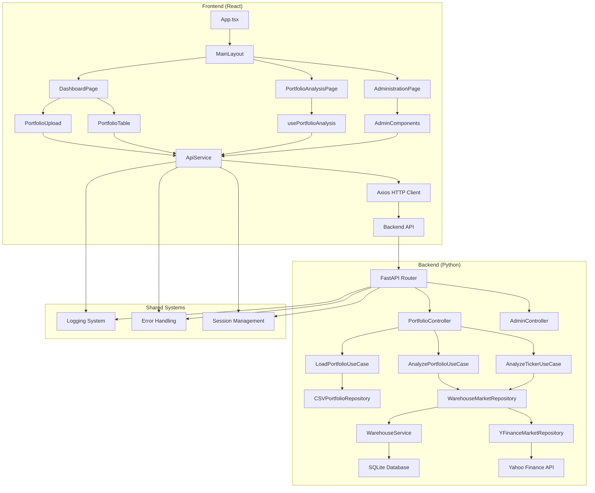
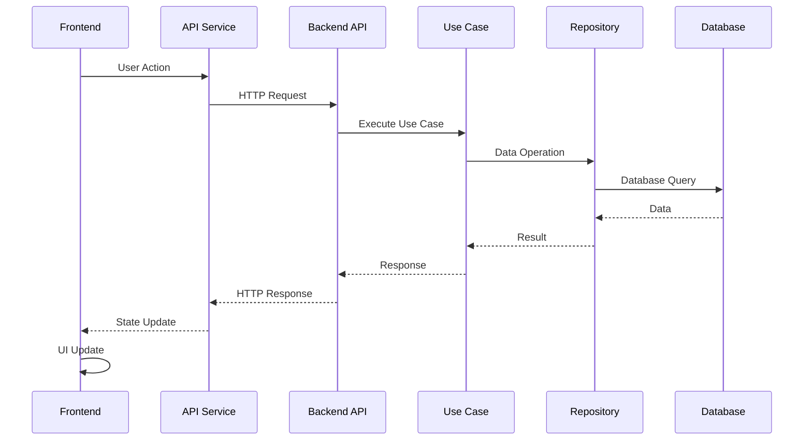
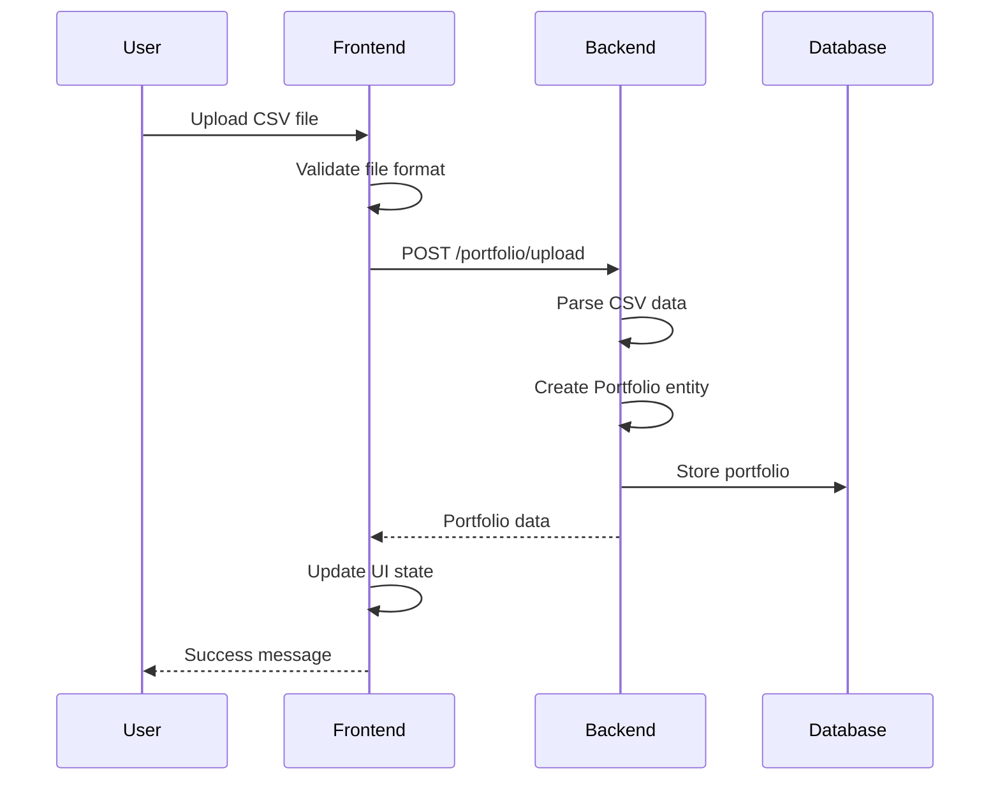
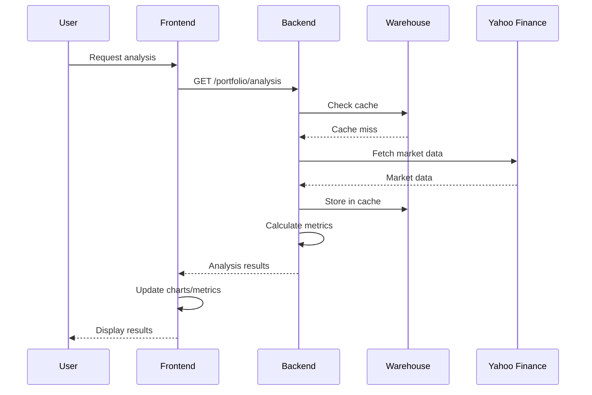
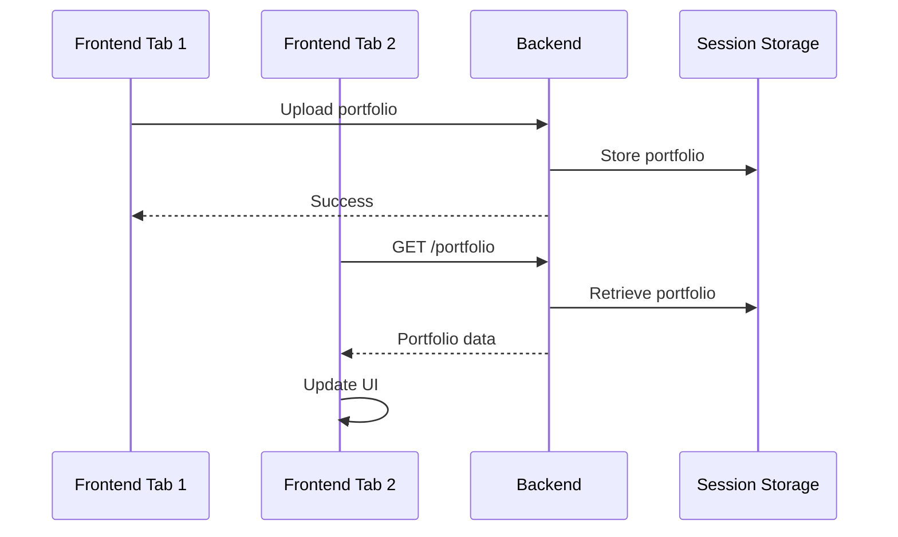
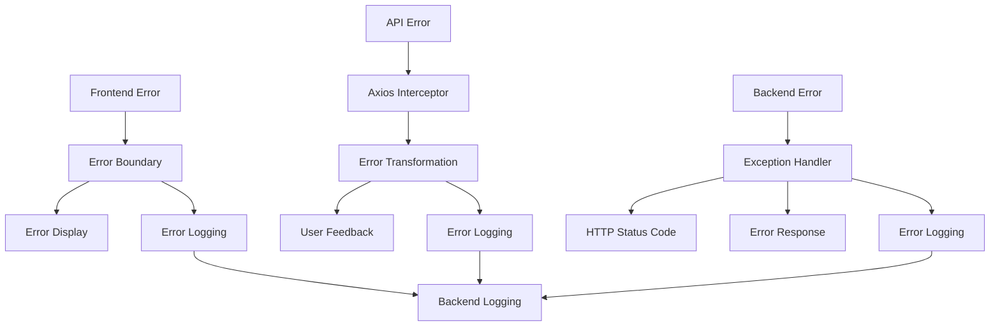
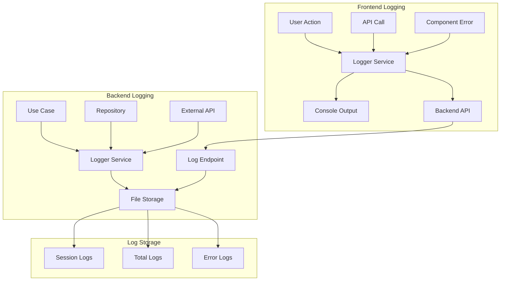

# 🔗 Backend <> Frontend Integration Documentation

## Table of Contents
- [1. Overview](#1-overview)
- [2. Architecture Integration](#2-architecture-integration)
- [3. API Communication](#3-api-communication)
- [4. Data Flow & Synchronization](#4-data-flow--synchronization)
- [5. Data Models & Type Mapping](#5-data-models--type-mapping)
- [6. Authentication & Security](#6-authentication--security)
- [7. Error Handling Integration](#7-error-handling-integration)
- [8. Logging & Monitoring Integration](#8-logging--monitoring-integration)
- [9. Performance Considerations](#9-performance-considerations)
- [10. State Management](#10-state-management)
- [11. Real-time Communication](#11-real-time-communication)
- [12. Development Workflow](#12-development-workflow)
- [13. Deployment Integration](#13-deployment-integration)
- [14. Troubleshooting](#14-troubleshooting)
- [15. Best Practices](#15-best-practices)

---

## 1. Overview

The Backend <> Frontend integration provides a seamless communication layer between the Python-based portfolio analysis backend and the React-based frontend application. This integration enables real-time portfolio management, analysis, and administration through a RESTful API architecture with comprehensive logging and error handling.

**Key Integration Features:**
- **RESTful API Communication**: HTTP-based communication with JSON payloads
- **Real-time Data Synchronization**: Portfolio state management across frontend and backend
- **Structured Logging**: Correlated logging between frontend and backend systems
- **Error Handling**: Comprehensive error propagation and user feedback
- **File Upload**: CSV portfolio file upload with validation
- **Session Management**: Portfolio session tracking and persistence
- **Administration Interface**: Backend management through frontend interface

**Communication Protocol:**
- **Transport**: HTTP/HTTPS over TCP
- **Format**: JSON for data exchange
- **Authentication**: None (development mode)
- **CORS**: Configured for localhost development

---

## 2. Architecture Integration

### System Architecture



### Integration Layers

#### 1. Transport Layer
- **Protocol**: HTTP/HTTPS
- **Ports**: Frontend (3000), Backend (8000)
- **CORS**: Configured for cross-origin requests
- **Timeout**: 5 minutes for large operations

#### 2. API Layer
- **Framework**: FastAPI (Backend) + Axios (Frontend)
- **Format**: JSON request/response
- **Validation**: Pydantic models (Backend) + TypeScript interfaces (Frontend)
- **Error Handling**: HTTP status codes + structured error messages

#### 3. Business Logic Layer
- **Backend**: Use cases orchestrate business logic
- **Frontend**: React hooks manage application state
- **Synchronization**: Real-time state updates via API calls

#### 4. Data Layer
- **Backend**: Repository pattern with SQLite warehouse
- **Frontend**: Local state with API synchronization
- **Persistence**: Backend manages data persistence

---

## 3. API Communication

### API Endpoints Mapping

| Frontend Method | Backend Endpoint | Method | Purpose | Request | Response |
|----------------|------------------|--------|---------|---------|----------|
| `uploadPortfolio()` | `/portfolio/upload` | POST | Upload CSV file | `FormData` | `PortfolioUploadResponse` |
| `getPortfolio()` | `/portfolio` | GET | Get current portfolio | None | `PortfolioResponse` |
| `clearPortfolio()` | `/portfolio` | DELETE | Clear portfolio | None | `ApiResponse` |
| `analyzePortfolio()` | `/portfolio/analysis` | GET | Analyze portfolio | Query params | `PortfolioAnalysis` |
| `analyzeTickers()` | `/portfolio/tickers/analysis` | POST | Analyze tickers | JSON body | `TickerAnalysis[]` |
| `healthCheck()` | `/health` | GET | Health check | None | `HealthResponse` |
| `sendLogs()` | `/api/logs` | POST | Send frontend logs | JSON body | `LogResponse` |

### Administrative Endpoints

| Frontend Method | Backend Endpoint | Method | Purpose | Request | Response |
|----------------|------------------|--------|---------|---------|----------|
| `clearAllLogs()` | `/api/admin/logs/clear-all` | POST | Clear all logs | None | `ApiResponse` |
| `clearAllWarehouse()` | `/api/admin/warehouse/clear-all` | POST | Clear warehouse | None | `ApiResponse` |
| `getWarehouseStats()` | `/api/admin/warehouse/stats` | GET | Get warehouse stats | None | `WarehouseStats` |
| `getWarehouseTickers()` | `/api/admin/warehouse/tickers` | GET | Get warehouse tickers | Query params | `TickerList` |
| `clearWarehouseTicker()` | `/api/admin/warehouse/clear-ticker` | POST | Clear ticker data | JSON body | `ApiResponse` |

### Request/Response Flow



---

## 4. Data Flow & Synchronization

### Portfolio Data Flow

#### 1. Portfolio Upload Flow


#### 2. Portfolio Analysis Flow


#### 3. Real-time State Synchronization


### State Management Integration

#### Frontend State
- **Local State**: React useState for component state
- **Global State**: Context providers for shared state
- **API State**: Loading, error, and success states
- **Portfolio State**: Current portfolio data

#### Backend State
- **Session State**: Portfolio session management
- **Global State**: Current portfolio in memory
- **Persistent State**: SQLite database storage
- **Cache State**: Warehouse system for performance

#### State Synchronization
- **Immediate Sync**: API calls for real-time updates
- **Session Persistence**: Portfolio survives server restarts
- **Cache Invalidation**: Warehouse cache management
- **Error Recovery**: Graceful handling of state inconsistencies

---

## 5. Data Models & Type Mapping

### TypeScript ↔ Python Type Mapping

#### Portfolio Data
```typescript
// Frontend TypeScript
interface Portfolio {
  positions: Position[];
  totalPositions: number;
  tickers: string[];
}

interface Position {
  ticker: string;
  position: number;
}
```

```python
# Backend Python
class PortfolioResponse(BaseModel):
    positions: List[PositionResponse]
    totalPositions: int
    tickers: List[str]

class PositionResponse(BaseModel):
    ticker: str
    position: float
```

#### Analysis Results
```typescript
// Frontend TypeScript
interface PortfolioAnalysis {
  success: boolean;
  message: string;
  data: {
    totalReturn: string;
    annualizedReturn: string;
    volatility: string;
    sharpeRatio: string;
    maxDrawdown: string;
    sortinoRatio: string;
    calmarRatio: string;
    var95: string;
    beta: string;
    startValue: string;
    endValue: string;
    endValueAnalysis: string;
    endValueMissing: string;
  };
  warnings: {
    missingTickers: string[];
    tickersWithoutStartData: string[];
  };
  timeSeriesData: {
    portfolioValues: Record<string, number>;
    sp500Values: Record<string, number>;
    nasdaqValues: Record<string, number>;
  };
}
```

```python
# Backend Python
class PortfolioAnalysisResponse(BaseModel):
    success: bool
    message: str
    data: PortfolioMetricsData
    warnings: DataWarnings
    timeSeriesData: TimeSeriesData

class PortfolioMetricsData(BaseModel):
    totalReturn: str
    annualizedReturn: str
    volatility: str
    sharpeRatio: str
    maxDrawdown: str
    sortinoRatio: str
    calmarRatio: str
    var95: str
    beta: str
    startValue: str
    endValue: str
    endValueAnalysis: str
    endValueMissing: str
```

#### Error Handling
```typescript
// Frontend TypeScript
interface ApiError {
  message: string;
  status?: number;
  details?: any;
}
```

```python
# Backend Python
class ApiResponse(BaseModel):
    success: bool
    message: str
    data: Optional[dict] = None

# HTTPException for error responses
raise HTTPException(status_code=404, detail="No portfolio loaded")
```

### Data Transformation

#### Backend → Frontend
```python
# Backend: Domain entity to API response
def portfolio_to_response(portfolio: Portfolio) -> PortfolioResponse:
    positions = [
        PositionResponse(ticker=pos.ticker.symbol, position=float(pos.quantity))
        for pos in portfolio.get_positions()
    ]
    return PortfolioResponse(
        positions=positions,
        totalPositions=int(sum(float(pos.quantity) for pos in portfolio.get_positions())),
        tickers=[t.symbol for t in portfolio.get_tickers()]
    )
```

#### Frontend → Backend
```typescript
// Frontend: Form data to API request
const formData = new FormData();
formData.append('file', file);
const response = await apiService.uploadPortfolio(file);
```

---

## 6. Authentication & Security

### Current Security Model
- **Authentication**: None (development mode)
- **Authorization**: None (all endpoints public)
- **CORS**: Configured for localhost development
- **Data Validation**: Input validation on both sides

### CORS Configuration
```python
# Backend CORS setup
app.add_middleware(
    CORSMiddleware,
    allow_origin_regex=r"https?://(localhost|127\.0\.0\.1)(:\d+)?$",
    allow_credentials=True,
    allow_methods=["*"],
    allow_headers=["*"],
)
```

### Input Validation
- **Frontend**: TypeScript type checking + runtime validation
- **Backend**: Pydantic model validation + business rule validation
- **File Upload**: CSV format validation and size limits
- **API Requests**: Request parameter validation

### Security Considerations
- **Data Sanitization**: Input sanitization on both sides
- **Error Information**: Limited error details in production
- **File Upload**: Secure temporary file handling
- **SQL Injection**: Parameterized queries in database layer

---

## 7. Error Handling Integration

### Error Flow Architecture



### Error Types & Handling

#### 1. Frontend Errors
- **Component Errors**: Caught by ErrorBoundary
- **API Errors**: Handled by Axios interceptors
- **Validation Errors**: Form validation feedback
- **Network Errors**: Connection timeout handling

#### 2. Backend Errors
- **Business Logic Errors**: Use case validation
- **Data Errors**: Repository operation failures
- **External API Errors**: Yahoo Finance API failures
- **System Errors**: Database connection issues

#### 3. Error Propagation
```typescript
// Frontend error handling
try {
  const response = await apiService.analyzePortfolio(dateRange);
  setAnalysisResults(response.data);
} catch (error) {
  const apiError = error as ApiError;
  setError(apiError.message || 'Analysis failed');
  logger.error('Portfolio analysis failed', error);
}
```

```python
# Backend error handling
try:
    result = use_case.execute(request)
    return result
except ValidationError as e:
    raise HTTPException(status_code=400, detail=str(e))
except BusinessLogicError as e:
    raise HTTPException(status_code=422, detail=str(e))
except Exception as e:
    logger.error(f"Unexpected error: {e}")
    raise HTTPException(status_code=500, detail="Internal server error")
```

### Error Recovery Strategies
- **Retry Logic**: Automatic retry for transient errors
- **Fallback UI**: Graceful degradation for component errors
- **User Feedback**: Clear error messages with recovery options
- **Logging**: Comprehensive error logging for debugging

---

## 8. Logging & Monitoring Integration

### Logging Architecture



### Frontend Logging System

#### Logger Service (`frontend/src/utils/logger.ts`)
```typescript
class Logger {
  private sessionId: string;
  private correlationId: string;
  private logLevel: LogLevelType;
  
  // Log levels: DEBUG, INFO, WARN, ERROR, CRITICAL
  debug(message: string, context?: Record<string, any>): void
  info(message: string, context?: Record<string, any>): void
  warn(message: string, context?: Record<string, any>): void
  error(message: string, context?: Record<string, any>): void
  critical(message: string, context?: Record<string, any>): void
  
  // Specialized logging methods
  logUserAction(action: string, details?: Record<string, any>): void
  logApiCall(method: string, url: string, status?: number, duration?: number, context?: Record<string, any>): void
}
```

#### Log Entry Structure
```typescript
interface LogEntry {
  timestamp: string;
  level: string;
  message: string;
  context?: Record<string, any>;
  sessionId?: string;
  correlationId?: string;
  userId?: string;
  operation?: string;
  duration?: number;
  error?: {
    name: string;
    message: string;
    stack?: string;
  };
}
```

### Backend Logging System

#### Log Reception (`backend/api.py`)
```python
@app.post("/api/logs")
async def receive_frontend_logs(log_entry: dict):
    """Receive structured logs from frontend and store in logs directory."""
    logger_service = get_logger_service()
    logger = logger_service.get_logger("frontend")
    
    # Create structured log message
    log_message = f"FRONTEND | {log_entry.get('message', 'Unknown message')}"
    
    # Add context information
    context = log_entry.get('context', {})
    if context:
        context_str = " | ".join([f"{k}: {v}" for k, v in context.items()])
        log_message += f" | {context_str}"
    
    # Log with appropriate level
    level = log_entry.get('level', 'INFO').upper()
    if level == 'DEBUG':
        logger.debug(log_message)
    elif level == 'INFO':
        logger.info(log_message)
    # ... other levels
```

### Log Correlation

#### Session Management
- **Frontend Session ID**: Generated on app start, stored in sessionStorage
- **Backend Session ID**: Portfolio session UUID for correlation
- **Correlation ID**: Request-specific ID for tracing

#### Log Format
```
[2024-01-15 10:30:45] [INFO] [SESSION:portfolio-abc123] [OPERATION:load_portfolio] Portfolio loaded successfully: 5 positions
[2024-01-15 10:30:46] [PERFORMANCE] [DURATION:0.250s] [API_CALL:yfinance] Fetched data for AAPL
[2024-01-15 10:30:47] [ERROR] [SESSION:portfolio-abc123] [OPERATION:analyze_portfolio] Failed to fetch data for INVALID
```

### Performance Monitoring

#### Frontend Metrics
- **User Actions**: File uploads, analysis runs, navigation
- **API Calls**: Request/response times, success rates
- **Component Performance**: Render times, re-renders
- **Error Rates**: Component errors, API failures

#### Backend Metrics
- **Use Case Performance**: Operation timing and success rates
- **Repository Performance**: Database query times
- **External API Performance**: Yahoo Finance API response times
- **Warehouse Performance**: Cache hit/miss rates

---

## 9. Performance Considerations

### Frontend Performance

#### API Optimization
- **Request Batching**: Multiple API calls in single request
- **Caching Strategy**: Warehouse system for data persistence
- **Timeout Management**: Dynamic timeouts based on operation size
- **Error Retry**: Exponential backoff for failed requests

#### Component Optimization
- **React.memo**: Prevent unnecessary re-renders
- **useMemo**: Memoize expensive calculations
- **useCallback**: Memoize event handlers
- **Lazy Loading**: Code splitting for route-based chunks

### Backend Performance

#### Database Optimization
- **Connection Pooling**: Reuse database connections
- **Query Optimization**: Indexed queries and efficient SQL
- **Warehouse Caching**: 100x+ performance improvement for repeated requests
- **Parallel Processing**: Multi-threaded calculations and data fetching

#### API Optimization
- **Response Compression**: Gzip compression for large responses
- **Pagination**: Large dataset pagination
- **Async Operations**: Non-blocking I/O operations
- **Resource Management**: Proper cleanup of resources

### Performance Monitoring

#### Frontend Metrics
```typescript
// Performance logging
logger.logApiCall('POST', '/portfolio/analysis', 200, 2500, {
  portfolioSize: portfolio.tickers.length,
  dateRange: selectedDateRange
});
```

#### Backend Metrics
```python
# Performance monitoring
logger.log_performance(
    operation="analyze_portfolio",
    duration=2.5,
    details={
        "ticker_count": len(portfolio.get_tickers()),
        "date_range": f"{start_date} to {end_date}"
    }
)
```

---

## 10. State Management

### Frontend State Architecture

#### Local Component State
```typescript
// Component-level state
const [portfolio, setPortfolio] = useState<Portfolio | null>(null);
const [isLoading, setIsLoading] = useState(false);
const [error, setError] = useState<string | null>(null);
```

#### Global State Management
```typescript
// Context providers for shared state
<ToastProvider>
  <Router>
    <MainLayout />
  </Router>
</ToastProvider>
```

#### API State Management
```typescript
// Custom hook for API state
const {
  analysisResults,
  isLoading,
  error,
  runAnalysis,
  clearAnalysis
} = usePortfolioAnalysis();
```

### Backend State Architecture

#### Session State
```python
# Global portfolio state
_current_portfolio: Optional[Portfolio] = None
_current_portfolio_session: Optional[str] = None

# Persistent storage
PORTFOLIO_STORAGE_FILE = Path("/tmp/current_portfolio.json")
PORTFOLIO_SESSION_STORAGE_FILE = Path("/tmp/current_portfolio_session.json")
```

#### State Persistence
```python
def save_portfolio_to_disk(portfolio: Optional[Portfolio]) -> None:
    """Save portfolio to disk for persistence across server reloads."""
    if portfolio is None:
        if PORTFOLIO_STORAGE_FILE.exists():
            PORTFOLIO_STORAGE_FILE.unlink()
        return
    
    portfolio_data = {
        "positions": [
            {
                "ticker": pos.ticker.symbol,
                "quantity": float(pos.quantity)
            }
            for pos in portfolio.get_positions()
        ]
    }
    
    with open(PORTFOLIO_STORAGE_FILE, 'w') as f:
        json.dump(portfolio_data, f)
```

### State Synchronization

#### Real-time Updates
- **Immediate Sync**: API calls for real-time state updates
- **Optimistic Updates**: UI updates before API confirmation
- **Error Rollback**: Revert UI state on API errors
- **Conflict Resolution**: Last-write-wins strategy

#### State Consistency
- **Single Source of Truth**: Backend manages persistent state
- **Frontend Cache**: Local state for UI responsiveness
- **Cache Invalidation**: Clear cache on state changes
- **Error Recovery**: Graceful handling of state inconsistencies

---

## 11. Real-time Communication

### Current Communication Model
- **Request-Response**: Synchronous HTTP communication
- **No WebSockets**: No real-time bidirectional communication
- **Polling**: Frontend polls for updates when needed
- **Event-driven**: User actions trigger API calls

### Communication Patterns

#### 1. User Action → API Call
```typescript
// Frontend: User action triggers API call
const handleUpload = async (file: File) => {
  try {
    const response = await apiService.uploadPortfolio(file);
    setPortfolio(response.portfolio);
    showToast('Portfolio uploaded successfully', 'success');
  } catch (error) {
    showToast('Upload failed', 'error');
  }
};
```

#### 2. API Call → State Update
```typescript
// Frontend: API response updates state
const runAnalysis = async (dateRange: DateRange) => {
  setIsLoading(true);
  try {
    const response = await apiService.analyzePortfolio(dateRange);
    setAnalysisResults(response.data);
    setError(null);
  } catch (error) {
    setError(error.message);
  } finally {
    setIsLoading(false);
  }
};
```

#### 3. Error Handling → User Feedback
```typescript
// Frontend: Error handling with user feedback
const handleError = (error: ApiError) => {
  setError(error.message);
  showToast(error.message, 'error');
  logger.error('API call failed', error);
};
```

### Future Real-time Enhancements

#### WebSocket Integration
- **Real-time Updates**: Live portfolio updates
- **Collaborative Features**: Multi-user portfolio editing
- **Live Analysis**: Real-time analysis updates
- **Notification System**: Real-time notifications

#### Server-Sent Events
- **Progress Updates**: Long-running operation progress
- **Status Changes**: System status updates
- **Error Notifications**: Real-time error alerts
- **Performance Metrics**: Live performance monitoring

---

## 12. Development Workflow

### Local Development Setup

#### Frontend Development
```bash
# Start frontend development server
cd frontend
npm install
npm run dev
# Runs on http://localhost:3000
```

#### Backend Development
```bash
# Start backend development server
cd backend
python -m venv venv
source venv/bin/activate  # On Windows: venv\Scripts\activate
pip install -r requirements.txt
python api.py
# Runs on http://localhost:8000
```

#### Full-Stack Development
```bash
# Start both services
./local/run.sh start
# Frontend: http://localhost:3000
# Backend: http://localhost:8000
# API Docs: http://localhost:8000/docs
```

### Development Tools

#### Frontend Tools
- **Vite**: Fast development server with HMR
- **TypeScript**: Static type checking
- **ESLint**: Code quality and style
- **React DevTools**: Component debugging

#### Backend Tools
- **FastAPI**: Automatic API documentation
- **Pytest**: Testing framework
- **Black**: Code formatting
- **MyPy**: Static type checking

#### Integration Tools
- **CORS**: Cross-origin request handling
- **Proxy**: Development proxy configuration
- **Hot Reload**: Automatic server restart
- **Logging**: Integrated logging system

### Debugging Integration

#### Frontend Debugging
- **Browser DevTools**: Network, console, and performance
- **React DevTools**: Component state and props
- **Redux DevTools**: State management debugging
- **Logging**: Frontend logs sent to backend

#### Backend Debugging
- **FastAPI Docs**: Interactive API documentation
- **Logging**: Structured logging with correlation
- **Database**: SQLite database inspection
- **Performance**: Operation timing and metrics

---

## 13. Deployment Integration

### Current Deployment Model
- **Development Only**: Local development environment
- **No Production**: No production deployment configured
- **File-based Storage**: Local file system storage
- **No Containerization**: No Docker or container setup

### Deployment Considerations

#### Frontend Deployment
- **Static Hosting**: Can be deployed to any static host
- **Environment Variables**: API URL configuration
- **Build Optimization**: Minified and compressed assets
- **CDN Integration**: Content delivery network support

#### Backend Deployment
- **WSGI Server**: Production WSGI server (Gunicorn)
- **Database**: Production database (PostgreSQL)
- **File Storage**: Cloud storage for file uploads
- **Logging**: Centralized logging system

#### Integration Deployment
- **API Gateway**: Load balancing and routing
- **CORS Configuration**: Production CORS settings
- **SSL/TLS**: HTTPS encryption
- **Monitoring**: Application performance monitoring

---

## 14. Troubleshooting

### Common Issues

#### 1. CORS Errors
**Problem**: Frontend cannot access backend API
**Solution**: Check CORS configuration in backend
```python
# Backend CORS fix
app.add_middleware(
    CORSMiddleware,
    allow_origin_regex=r"https?://(localhost|127\.0\.0\.1)(:\d+)?$",
    allow_credentials=True,
    allow_methods=["*"],
    allow_headers=["*"],
)
```

#### 2. API Timeout Errors
**Problem**: Long-running operations timeout
**Solution**: Increase timeout in frontend configuration
```typescript
// Frontend timeout configuration
const config: ApiConfig = {
  baseURL: import.meta.env.VITE_API_BASE_URL || 'http://localhost:8000',
  timeout: 300000, // 5 minutes
  headers: {
    'Content-Type': 'application/json',
  },
};
```

#### 3. Portfolio State Issues
**Problem**: Portfolio state not synchronized
**Solution**: Check portfolio session management
```typescript
// Frontend: Refresh portfolio state
const refreshPortfolio = async () => {
  try {
    const portfolioData = await apiService.getPortfolio();
    setPortfolio(portfolioData);
  } catch (error) {
    setPortfolio(null);
  }
};
```

#### 4. Logging Issues
**Problem**: Logs not appearing in backend
**Solution**: Check logging configuration and network
```typescript
// Frontend: Check logging configuration
const logger = new Logger();
logger.debug('Test log message', { test: true });
```

### Debugging Steps

#### 1. Check Network Connectivity
- Verify backend is running on port 8000
- Check CORS configuration
- Test API endpoints directly

#### 2. Check Logs
- Frontend console logs
- Backend log files
- Network request/response logs

#### 3. Check State
- Frontend component state
- Backend portfolio state
- Database state

#### 4. Check Configuration
- Environment variables
- API configuration
- CORS settings

---

## 15. Best Practices

### API Design

#### 1. Consistent Response Format
```typescript
// Frontend: Consistent error handling
interface ApiResponse<T> {
  success: boolean;
  message: string;
  data?: T;
}
```

#### 2. Proper HTTP Status Codes
```python
# Backend: Appropriate status codes
raise HTTPException(status_code=404, detail="No portfolio loaded")
raise HTTPException(status_code=400, detail="Invalid file format")
raise HTTPException(status_code=500, detail="Internal server error")
```

#### 3. Input Validation
```typescript
// Frontend: Input validation
const validateFile = (file: File): boolean => {
  return file.type === 'text/csv' && file.size < 10 * 1024 * 1024; // 10MB
};
```

### Error Handling

#### 1. Graceful Error Recovery
```typescript
// Frontend: Error recovery
const handleError = (error: ApiError) => {
  setError(error.message);
  showToast(error.message, 'error');
  logger.error('Operation failed', error);
  // Provide recovery options
};
```

#### 2. User-Friendly Error Messages
```python
# Backend: Clear error messages
raise HTTPException(
    status_code=400, 
    detail="Invalid CSV format. Please ensure file has 'ticker,position' columns."
)
```

### Performance

#### 1. Optimize API Calls
```typescript
// Frontend: Debounced API calls
const debouncedAnalysis = useMemo(
  () => debounce(runAnalysis, 500),
  [runAnalysis]
);
```

#### 2. Cache Management
```python
# Backend: Efficient caching
@lru_cache(maxsize=128)
def get_cached_analysis(ticker: str, date_range: str) -> AnalysisResult:
    return perform_analysis(ticker, date_range)
```

### Security

#### 1. Input Sanitization
```typescript
// Frontend: Sanitize user input
const sanitizeInput = (input: string): string => {
  return input.trim().replace(/[<>]/g, '');
};
```

#### 2. File Upload Security
```python
# Backend: Secure file handling
def validate_csv_file(file: UploadFile) -> bool:
    if not file.filename.endswith('.csv'):
        return False
    if file.size > 10 * 1024 * 1024:  # 10MB limit
        return False
    return True
```

### Logging

#### 1. Structured Logging
```typescript
// Frontend: Structured logging
logger.logUserAction('portfolio_uploaded', {
  fileName: file.name,
  fileSize: file.size,
  tickerCount: portfolio.tickers.length
});
```

#### 2. Log Correlation
```python
# Backend: Correlated logging
logger.info(
    f"Portfolio analysis completed",
    extra={
        "session_id": session_id,
        "operation": "analyze_portfolio",
        "duration": duration,
        "ticker_count": len(tickers)
    }
)
```

---

## Conclusion

The Backend <> Frontend integration provides a robust, scalable communication layer that enables seamless portfolio analysis functionality. The system features comprehensive error handling, structured logging, and performance optimizations that ensure a smooth user experience.

Key integration strengths:
- **Clean Architecture**: Clear separation of concerns between frontend and backend
- **Type Safety**: Comprehensive TypeScript and Python type definitions
- **Error Handling**: Graceful error recovery and user feedback
- **Performance**: Optimized API calls and caching strategies
- **Logging**: Correlated logging across both systems
- **Maintainability**: Well-documented integration patterns

For questions or updates to this integration documentation, please refer to the project's technical documentation or contact the development team.

---

*Last updated: January 2025*
*Version: 1.0.0*
