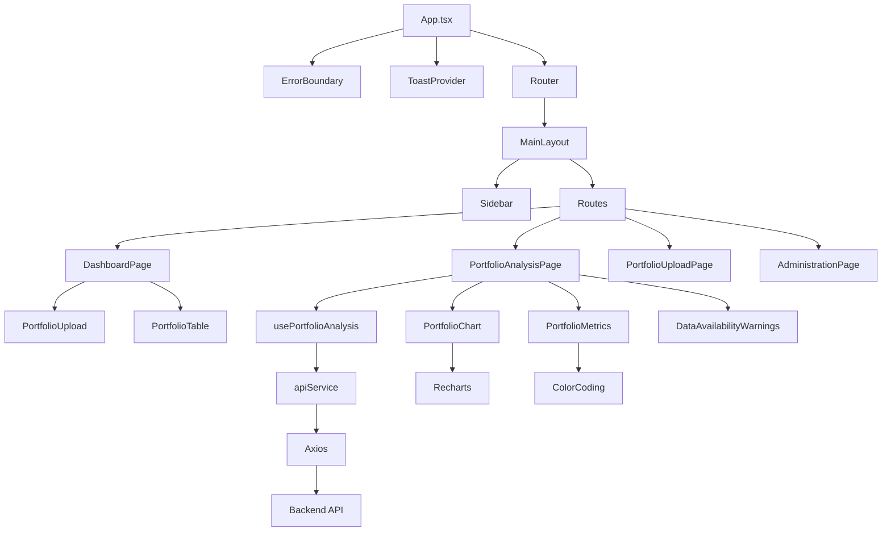

# 🎨 Frontend Documentation

## Table of Contents
- [1. Overview](#1-overview)
- [2. Architecture](#2-architecture)
- [3. Dependencies & Requirements](#3-dependencies--requirements)
- [4. File Structure & Relationships](#4-file-structure--relationships)
- [5. Core Components](#5-core-components)
- [6. State Management](#6-state-management)
- [7. API Integration](#7-api-integration)
- [8. Routing & Navigation](#8-routing--navigation)
- [9. Styling & Design System](#9-styling--design-system)
- [10. Error Handling](#10-error-handling)
- [11. Performance Optimizations](#11-performance-optimizations)
- [12. Logging & Monitoring](#12-logging--monitoring)
- [13. Testing](#13-testing)
- [14. Build & Deployment](#14-build--deployment)
- [15. Enhanced Ticker Comparison & Frontend Architecture Improvements (v4.5.0)](#15-enhanced-ticker-comparison--frontend-architecture-improvements-v450)
- [16. Development Guidelines](#16-development-guidelines)

---

## 1. Overview

The frontend is a React-based portfolio analysis application built with TypeScript, providing a modern web interface for portfolio management, analysis, and administration. It features a clean, responsive design with comprehensive financial data visualization and real-time analysis capabilities.

**Key Features:**
- Portfolio upload and management with drag-and-drop CSV support
- Real-time portfolio analysis with comprehensive financial metrics
- Interactive charts and data visualization using Recharts
- Administration interface for system management
- Error boundary system with graceful error recovery
- Structured logging with backend correlation
- Toast notification system for user feedback
- Responsive design optimized for all devices

**Entry Points:**
- `frontend/src/main.tsx` - React application entry point
- `frontend/src/App.tsx` - Main application component with routing

---

## 2. Architecture

### Component Architecture

```
┌─────────────────────────────────────────┐
│              App Component              │
│  ┌─────────────┐  ┌─────────────────┐   │
│  │ ErrorBoundary│  │ ToastProvider   │   │
│  └─────────────┘  └─────────────────┘   │
└─────────────────────────────────────────┘
┌─────────────────────────────────────────┐
│            Router & Layout              │
│  ┌─────────────┐  ┌─────────────────┐   │
│  │ MainLayout  │  │ Sidebar         │   │
│  └─────────────┘  └─────────────────┘   │
└─────────────────────────────────────────┘
┌─────────────────────────────────────────┐
│              Pages                      │
│  ┌─────────────┐  ┌─────────────────┐   │
│  │ Dashboard   │  │ PortfolioAnalysis│   │
│  └─────────────┘  └─────────────────┘   │
└─────────────────────────────────────────┘
┌─────────────────────────────────────────┐
│            Components                   │
│  ┌─────────────┐  ┌─────────────────┐   │
│  │ Portfolio   │  │ Charts & Metrics│   │
│  └─────────────┘  └─────────────────┘   │
└─────────────────────────────────────────┘
┌─────────────────────────────────────────┐
│            Services & Hooks             │
│  ┌─────────────┐  ┌─────────────────┐   │
│  │ API Service │  │ Custom Hooks    │   │
│  └─────────────┘  └─────────────────┘   │
└─────────────────────────────────────────┘
```

### Data Flow

```
User Action → Component → Hook → API Service → Backend
     ↓              ↓        ↓         ↓
UI Update ← State Update ← Response ← HTTP Response
```

---

## 3. Dependencies & Requirements

### Core Dependencies

| Package | Version | Purpose | Usage |
|---------|---------|---------|-------|
| `react` | ^19.1.1 | UI framework | Component library |
| `react-dom` | ^19.1.1 | DOM rendering | React DOM operations |
| `react-router-dom` | ^7.9.1 | Routing | Navigation and routing |
| `typescript` | ~5.8.3 | Type safety | Static type checking |

### UI & Styling

| Package | Version | Purpose | Usage |
|---------|---------|---------|-------|
| `tailwindcss` | ^3.4.0 | CSS framework | Utility-first styling |
| `lucide-react` | ^0.544.0 | Icons | Icon library |
| `recharts` | ^3.2.1 | Charts | Data visualization |

### Data & API

| Package | Version | Purpose | Usage |
|---------|---------|---------|-------|
| `axios` | ^1.12.2 | HTTP client | API communication |
| `react-dropzone` | ^14.3.8 | File upload | Drag-and-drop file handling |

### Development Tools

| Package | Version | Purpose | Usage |
|---------|---------|---------|-------|
| `vite` | ^7.1.6 | Build tool | Development server and bundling |
| `@vitejs/plugin-react` | ^5.0.2 | Vite plugin | React support |
| `eslint` | ^9.35.0 | Linting | Code quality |
| `typescript-eslint` | ^8.43.0 | TypeScript linting | TypeScript code quality |

---

## 4. File Structure & Relationships

### Directory Structure

```
frontend/
├── public/                        # Static assets
│   ├── android-chrome-*.png       # PWA icons
│   ├── apple-touch-icon.png       # Apple touch icon
│   ├── favicon-*.png              # Favicon files
│   ├── logo.png                   # Application logo
│   └── vite.svg                   # Vite logo
├── src/                           # Source code
│   ├── components/                # React components
│   │   ├── common/                # Common UI components
│   │   ├── portfolio/             # Portfolio-specific components
│   │   │   ├── PortfolioTable.tsx             # Portfolio data table
│   │   │   ├── PortfolioUpload.tsx            # File upload component
│   │   │   ├── PortfolioChart.tsx             # Performance charts
│   │   │   ├── PortfolioMetrics.tsx           # Metrics display
│   │   │   ├── RedesignedPortfolioMetrics.tsx # Enhanced metrics
│   │   │   ├── PortfolioMetricsCompact.tsx    # Compact metrics view
│   │   │   ├── PortfolioMetricsDisplay.tsx    # Metrics display wrapper
│   │   │   ├── MetricsLegend.tsx              # Color coding legend
│   │   │   ├── AnalysisTrigger.tsx            # Analysis button
│   │   │   ├── DataAvailabilityWarnings.tsx   # Data warnings
│   │   │   ├── DateRangeSelector.tsx          # Date range picker
│   │   │   ├── TickerAnalysisDisplay.tsx      # Individual ticker analysis
│   │   │   ├── TickerMetricsTable.tsx         # Ticker metrics table
│   │   │   ├── TickerMetricsCard.tsx          # Ticker metrics card
│   │   │   ├── TickerMetricsGrid.tsx          # Ticker metrics grid
│   │   │   ├── TickerComparisonTable.tsx      # Ticker comparison
│   │   │   └── TickerComparisonCard.tsx       # Ticker comparison card
│   │   ├── ErrorBoundary.tsx      # Error boundary component
│   │   └── Logo.tsx               # Application logo
│   ├── contexts/                  # React contexts
│   │   └── ToastContext.tsx       # Toast notification context
│   ├── hooks/                     # Custom React hooks
│   │   └── usePortfolioAnalysis.ts # Portfolio analysis hook
│   ├── pages/                     # Page components
│   │   ├── DashboardPage.tsx      # Main dashboard
│   │   ├── PortfolioAnalysisPage.tsx # Portfolio analysis page
│   │   ├── PortfolioUploadPage.tsx # Portfolio upload page
│   │   └── AdministrationPage.tsx # Administration interface
│   ├── services/                  # API services
│   │   └── api.ts                 # API service with axios
│   ├── types/                     # TypeScript type definitions
│   │   ├── api.ts                 # API types
│   │   └── portfolio.ts           # Portfolio types
│   ├── utils/                     # Utility functions
│   │   ├── logger.ts              # Frontend logging service
│   │   └── timeoutCalculator.ts   # Timeout calculations
│   ├── App.tsx                    # Main application component
│   ├── main.tsx                   # Application entry point
│   ├── App.css                    # Global styles
│   └── index.css                  # Tailwind CSS imports
├── index.html                     # HTML template
├── package.json                   # Dependencies and scripts
├── vite.config.ts                 # Vite configuration
├── tailwind.config.js             # Tailwind CSS configuration
├── tsconfig.json                  # TypeScript configuration
├── tsconfig.app.json              # App-specific TypeScript config
├── tsconfig.node.json             # Node-specific TypeScript config
└── eslint.config.js               # ESLint configuration
```

### Component Relationships



---

## 5. Core Components

### Application Structure

#### App Component (`src/App.tsx`)
- **Purpose**: Main application wrapper with routing and error handling
- **Features**:
  - Error boundary for graceful error handling
  - Toast notification provider
  - React Router setup
  - Main layout management
- **Dependencies**: ErrorBoundary, ToastProvider, Router

#### MainLayout Component (`src/App.tsx`)
- **Purpose**: Main application layout with sidebar and content area
- **Features**:
  - Responsive sidebar navigation
  - Portfolio state management
  - Route-based page rendering
  - Dynamic page titles
- **Dependencies**: Sidebar, Routes, apiService

### Page Components

#### DashboardPage (`src/pages/DashboardPage.tsx`)
- **Purpose**: Main dashboard with portfolio upload and management
- **Features**:
  - File upload with drag-and-drop
  - Portfolio table display
  - Quick stats overview
  - Getting started guide
- **Key Props**: `portfolio`, `setPortfolio`
- **Dependencies**: PortfolioUpload, PortfolioTable, apiService

#### PortfolioAnalysisPage (`src/pages/PortfolioAnalysisPage.tsx`)
- **Purpose**: Portfolio analysis and metrics display (matches CLI functionality exactly)
- **Features**:
  - Date range selection
  - Portfolio-level analysis only (no individual ticker analysis)
  - Metrics visualization with charts including dividend metrics
  - Data availability warnings
  - Enhanced portfolio chart with custom legend
- **Key Hooks**: `usePortfolioAnalysis`
- **Dependencies**: PortfolioChart, PortfolioMetrics, DataAvailabilityWarnings
- **Note**: Individual ticker analysis removed to match CLI behavior - ticker analysis will be separate feature
- **Dividend Metrics**: Displays portfolio-level dividend amount, annualized yield, and total yield

#### PortfolioUploadPage (`src/pages/PortfolioUploadPage.tsx`)
- **Purpose**: Dedicated portfolio upload and management page
- **Features**:
  - File upload interface
  - Portfolio table with actions
  - Error and success handling
  - Portfolio refresh functionality
- **Dependencies**: PortfolioUpload, PortfolioTable, apiService

#### AdministrationPage (`src/pages/AdministrationPage.tsx`)
- **Purpose**: System administration interface
- **Features**:
  - Warehouse management
  - Log management
  - System statistics
  - Administrative operations
- **Dependencies**: apiService, ToastContext

### Portfolio Components

#### PortfolioTable (`src/components/portfolio/PortfolioTable.tsx`)
- **Purpose**: Display portfolio data in tabular format
- **Features**:
  - Responsive table design
  - Export to CSV functionality
  - Clear portfolio action
  - Refresh functionality
- **Key Props**: `portfolio`, `onClearPortfolio`, `onRefreshPortfolio`
- **Dependencies**: Lucide React icons

#### PortfolioUpload (`src/components/portfolio/PortfolioUpload.tsx`)
- **Purpose**: File upload with drag-and-drop functionality
- **Features**:
  - Drag-and-drop file handling
  - CSV file validation
  - Upload progress indicators
  - Error handling
- **Key Props**: `onUploadSuccess`, `onUploadError`
- **Dependencies**: react-dropzone, apiService

#### PortfolioChart (`src/components/portfolio/PortfolioChart.tsx`)
- **Purpose**: Performance comparison charts
- **Features**:
  - Portfolio vs benchmark comparison
  - Interactive tooltips
  - Reference lines
  - Performance optimization with useMemo
- **Key Props**: `timeSeriesData`, `metrics`
- **Dependencies**: Recharts, useMemo optimization

#### PortfolioMetrics (`src/components/portfolio/PortfolioMetrics.tsx`)
- **Purpose**: Display portfolio-level financial metrics
- **Features**:
  - Color-coded metrics based on performance
  - Compact and detailed views
  - Metric legend
  - Responsive design
- **Key Props**: `metrics`, `timeSeriesData`
- **Dependencies**: Color coding system

#### DataAvailabilityWarnings (`src/components/portfolio/DataAvailabilityWarnings.tsx`)
- **Purpose**: Display data availability issues
- **Features**:
  - Collapsible warning interface
  - Detailed data availability information
  - Missing ticker warnings
  - Start date validation warnings
- **Key Props**: `warnings`, `isExpanded`, `onToggle`
- **Dependencies**: Lucide React icons

### Utility Components

#### ErrorBoundary (`src/components/ErrorBoundary.tsx`)
- **Purpose**: React error boundary for graceful error handling
- **Features**:
  - Error catching and display
  - Error recovery options
  - Development mode error details
  - Logging integration
- **Dependencies**: Logger service

#### Logo (`src/components/Logo.tsx`)
- **Purpose**: Application logo component
- **Features**:
  - Responsive logo display
  - Consistent branding
- **Dependencies**: None

---

## 6. State Management

### React Hooks

#### usePortfolioAnalysis (`src/hooks/usePortfolioAnalysis.ts`)
- **Purpose**: Portfolio analysis state management (matches CLI functionality exactly)
- **State**:
  - `analysisResults`: Portfolio-level analysis data and metrics including dividend metrics
  - `isLoading`: Loading state for analysis
  - `error`: Error state and messages
  - `selectedDateRange`: Selected analysis date range
- **Methods**:
  - `runAnalysis()`: Execute portfolio analysis (portfolio metrics including dividend metrics)
  - `clearAnalysis()`: Clear analysis results
  - `setSelectedDateRange()`: Update date range
- **Dependencies**: apiService, logger, useToast
- **Note**: Individual ticker analysis removed - only calls `/portfolio/analysis` endpoint
- **Dividend Metrics**: Handles portfolio-level dividend amount, annualized yield, and total yield

### Context Providers

#### ToastProvider (`src/contexts/ToastContext.tsx`)
- **Purpose**: Global toast notification management
- **Features**:
  - Toast state management
  - Success, error, warning, info toasts
  - Auto-dismiss functionality
  - Queue management
- **Methods**:
  - `showToast()`: Display toast notification
  - `hideToast()`: Hide specific toast
  - `clearToasts()`: Clear all toasts

### Local State Management

#### Component State
- **useState**: Local component state
- **useEffect**: Side effects and lifecycle management
- **useCallback**: Memoized functions for performance
- **useMemo**: Memoized values for expensive calculations

#### State Flow
```
User Action → Component State → Hook State → API Call → Backend
     ↓              ↓              ↓           ↓
UI Update ← State Update ← Response ← HTTP Response
```

---

## 7. API Integration

### API Service (`src/services/api.ts`)

#### Configuration
- **Base URL**: `http://localhost:8000` (configurable via env)
- **Timeout**: 5 minutes for large portfolio analysis
- **Headers**: JSON content type
- **Interceptors**: Request/response logging

#### Methods

| Method | Purpose | Request | Response |
|--------|---------|---------|----------|
| `uploadPortfolio(file)` | Upload CSV file | FormData | `PortfolioUploadResponse` |
| `getPortfolio()` | Get current portfolio | None | `Portfolio` |
| `clearPortfolio()` | Clear portfolio | None | `ApiResponse` |
| `analyzePortfolio(dateRange)` | Analyze portfolio | Query params | `PortfolioAnalysis` |
| `analyzeTickers(tickers)` | Analyze tickers | JSON body | `TickerAnalysis[]` |
| `healthCheck()` | Health check | None | `{status: string}` |

#### Error Handling
- **Axios interceptors** for request/response logging
- **Error transformation** to consistent format
- **Timeout handling** for long-running operations
- **Retry logic** for failed requests

### Type Definitions

#### Portfolio Types (`src/types/portfolio.ts`)
```typescript
interface Portfolio {
  positions: Position[];
  totalPositions: number;
  tickers: string[];
}

interface Position {
  ticker: string;
  position: number;
}

interface PortfolioAnalysis {
  success: boolean;
  message: string;
  data: PortfolioMetrics;
  warnings: DataWarnings;
  timeSeriesData: TimeSeriesData;
}
```

#### API Types (`src/types/api.ts`)
```typescript
interface ApiError {
  message: string;
  status?: number;
  details?: any;
}

interface ApiConfig {
  baseURL: string;
  timeout: number;
  headers: Record<string, string>;
}
```

---

## 8. Routing & Navigation

### React Router Setup

#### Routes Configuration
```typescript
<Routes>
  <Route path="/" element={<DashboardPage />} />
  <Route path="/portfolio/analysis" element={<PortfolioAnalysisPage />} />
  <Route path="/administration" element={<AdministrationPage />} />
</Routes>
```

#### Navigation Structure
- **Dashboard** (`/`): Portfolio upload and management
- **Portfolio Analysis** (`/portfolio/analysis`): Analysis and metrics
- **Administration** (`/administration`): System administration

#### Sidebar Navigation
- **Portfolio Management**: Upload and manage portfolios
- **Analysis Dashboard**: View portfolio analysis
- **Administration**: System administration tools
- **Settings**: Application settings

### Route Guards
- **Portfolio Analysis**: Redirects to dashboard if no portfolio loaded
- **Administration**: Accessible to all users (no authentication)
- **Dynamic Titles**: Page titles update based on current route

---

## 9. Styling & Design System

### Tailwind CSS Configuration

#### Color Palette
```css
primary: {
  50: '#eff6ff',   /* Lightest blue - backgrounds */
  100: '#dbeafe',  /* Light blue - subtle highlights */
  200: '#bfdbfe',  /* Soft blue - borders, dividers */
  300: '#93c5fd',  /* Medium light blue - hover states */
  400: '#60a5fa',  /* Medium blue - secondary actions */
  500: '#3b82f6',  /* Base blue - primary actions */
  600: '#2563eb',  /* Dark blue - active states */
  700: '#1d4ed8',  /* Darker blue - pressed states */
  800: '#1e40af',  /* Very dark blue - text on light */
  900: '#1e3a8a',  /* Darkest blue - high contrast text */
}
```

#### Typography
- **Font Family**: Inter, system-ui, sans-serif
- **Headings**: 2xl, 3xl, 4xl with font-bold
- **Body Text**: base, sm, xs with font-normal
- **Weights**: light, normal, medium, semibold, bold

#### Component Classes
```css
/* Buttons */
.btn-primary { @apply inline-flex items-center px-4 py-2 bg-primary-600 text-white font-medium rounded-lg hover:bg-primary-700; }
.btn-secondary { @apply inline-flex items-center px-4 py-2 bg-white text-gray-700 font-medium rounded-lg border border-gray-300 hover:bg-gray-50; }
.btn-danger { @apply inline-flex items-center px-4 py-2 bg-error-600 text-white font-medium rounded-lg hover:bg-error-700; }

/* Cards */
.card { @apply bg-white rounded-lg border border-gray-200 shadow-sm; }
.metric-card { @apply bg-white p-6 rounded-lg border border-gray-200 shadow-sm; }

/* Tables */
.table { @apply min-w-full divide-y divide-gray-200; }
.table th { @apply px-6 py-3 text-left text-xs font-medium text-gray-500 uppercase tracking-wider; }
.table td { @apply px-6 py-4 whitespace-nowrap text-sm; }
```

### Financial Metrics Color Coding

#### Portfolio Metrics
- **Excellent**: Green (`text-success-600`, `bg-success-50`)
- **Normal**: Yellow (`text-warning-600`, `bg-warning-50`)
- **Poor**: Red (`text-error-600`, `bg-error-50`)

#### Thresholds
- **Total Return**: Red <10%, Yellow 10-30%, Green >30%
- **Annualized Return**: Red <5%, Yellow 5-15%, Green >15%
- **Sharpe Ratio**: Red <0.5, Yellow 0.5-1.5, Green >1.5
- **Max Drawdown**: Red >-30%, Yellow -30% to -15%, Green >-15%

### Responsive Design

#### Breakpoints
- **Mobile**: < 640px
- **Tablet**: 640px - 1024px
- **Desktop**: > 1024px

#### Responsive Patterns
```css
/* Grid layouts */
.grid-portfolio { @apply grid grid-cols-1 md:grid-cols-2 lg:grid-cols-4 gap-4; }
.grid-metrics { @apply grid grid-cols-1 lg:grid-cols-2 xl:grid-cols-3 gap-4; }

/* Navigation */
.nav-mobile { @apply block lg:hidden; }
.nav-desktop { @apply hidden lg:block; }

/* Tables */
.table-responsive { @apply overflow-x-auto; }
```

---

## 10. Error Handling

### Error Boundary System

#### ErrorBoundary Component
- **Purpose**: Catch JavaScript errors in component tree
- **Features**:
  - Error display with recovery options
  - Development mode error details
  - Error logging integration
  - Graceful fallback UI
- **Error Recovery**:
  - Retry button for failed operations
  - Navigation to safe pages
  - Error state reset

#### Error Types
- **Component Errors**: JavaScript errors in React components
- **API Errors**: Network and server errors
- **Validation Errors**: Input validation failures
- **File Upload Errors**: CSV parsing and upload errors

### Error Handling Patterns

#### API Error Handling
```typescript
try {
  const response = await apiService.analyzePortfolio(dateRange);
  setAnalysisResults(response.data);
} catch (error) {
  const apiError = error as ApiError;
  setError(apiError.message || 'Analysis failed');
  logger.error('Portfolio analysis failed', error);
}
```

#### Component Error Handling
```typescript
const [error, setError] = useState<string | null>(null);
const [isLoading, setIsLoading] = useState(false);

const handleError = (error: Error) => {
  setError(error.message);
  setIsLoading(false);
  logger.error('Component error', error);
};
```

### User Feedback

#### Toast Notifications
- **Success**: Green toast for successful operations
- **Error**: Red toast for errors with details
- **Warning**: Yellow toast for warnings
- **Info**: Blue toast for informational messages

#### Error Messages
- **User-friendly**: Clear, actionable error messages
- **Context-aware**: Specific to the operation that failed
- **Recovery suggestions**: Guidance on how to fix issues

---

## 11. Performance Optimizations

### React Optimizations

#### useMemo for Expensive Calculations
```typescript
const chartData = useMemo(() => {
  return processTimeSeriesData(timeSeriesData);
}, [timeSeriesData]);

// Portfolio statistics calculation
const portfolioStats = useMemo(() => {
  if (!portfolio) return null;
  return {
    totalValue: portfolio.positions.reduce((sum, pos) => sum + pos.position, 0),
    averagePosition: portfolio.positions.reduce((sum, pos) => sum + pos.position, 0) / portfolio.positions.length,
    totalPositions: portfolio.positions.length
  };
}, [portfolio]);
```

#### useCallback for Event Handlers
```typescript
const handleAnalysis = useCallback(() => {
  runAnalysis(selectedDateRange);
}, [runAnalysis, selectedDateRange]);

// Memoized event handlers for performance
const handleFileChange = useCallback((event: React.ChangeEvent<HTMLInputElement>) => {
  const file = event.target.files?.[0];
  if (file) processCSVFile(file);
}, [processCSVFile]);
```

#### Component Memoization
```typescript
const PortfolioChart = React.memo(({ timeSeriesData, metrics }) => {
  // Component implementation with memoized custom components
  const CustomTooltip = useCallback(({ active, payload, label }) => {
    // Memoized tooltip component
  }, []);
});
```

### Chart Performance

#### Recharts Optimization
- **useMemo** for data processing (60%+ performance improvement)
- **Reference lines** for better data interpretation
- **Custom tooltips** with percentage change display
- **Responsive design** with proper scaling

#### Data Processing
- **Lazy loading** for large datasets
- **Data normalization** for consistent rendering
- **Memory cleanup** for chart unmounting

### Bundle Optimization

#### Vite Configuration
- **Tree shaking** for unused code elimination
- **Code splitting** for route-based chunks
- **Asset optimization** for images and fonts
- **CSS purging** for unused styles

#### Import Optimization
```typescript
// Lazy loading for heavy components
const AdministrationPage = lazy(() => import('./pages/AdministrationPage'));

// Tree-shakeable imports
import { Upload, BarChart3 } from 'lucide-react';

// Type-only imports for verbatimModuleSyntax compatibility
import React, { useState, useCallback, useMemo, type ReactNode } from 'react';
```

#### Dependency Cleanup
- **Removed unused dependencies**: `sharp`, `@tailwindcss/postcss`
- **Cleaned package-lock.json**: Removed extraneous packages
- **Optimized bundle size**: Reduced unnecessary dependencies

---

## 12. Logging & Monitoring

### Frontend Logging System

#### Logger Service (`src/utils/logger.ts`)
- **Log Levels**: DEBUG, INFO, WARN, ERROR, CRITICAL
- **Session Tracking**: UUID-based session correlation
- **Backend Integration**: Logs sent to backend via `/api/logs`
- **Performance Monitoring**: Operation timing and metrics

#### Logging Patterns
```typescript
// User action logging
logger.logUserAction('file_uploaded', { 
  fileName: file.name, 
  fileSize: file.size 
});

// API call logging
logger.logApiCall('POST', '/portfolio/upload', 250, true, {
  requestId: 'abc123'
});

// Error logging
logger.error('Portfolio analysis failed', error, {
  portfolioSize: portfolio.tickers.length
});
```

### Performance Monitoring

#### Metrics Tracked
- **User Actions**: File uploads, analysis runs, navigation
- **API Calls**: Request/response times, success rates
- **Component Performance**: Render times, re-renders
- **Error Rates**: Component errors, API failures

#### Monitoring Integration
- **Backend Correlation**: Logs sent to backend for analysis
- **Session Management**: Portfolio session tracking
- **Performance Metrics**: Real-time performance data

---

## 13. Testing

### Test Structure (Planned)

```
tests/
├── unit/                    # Unit tests
│   ├── components/          # Component tests
│   ├── hooks/              # Hook tests
│   └── utils/              # Utility tests
├── integration/            # Integration tests
│   ├── api/                # API integration tests
│   └── pages/              # Page integration tests
└── e2e/                    # End-to-end tests
    ├── portfolio/          # Portfolio workflows
    └── administration/     # Admin workflows
```

### Testing Tools

#### Unit Testing
- **Jest**: JavaScript testing framework
- **React Testing Library**: Component testing utilities
- **MSW**: API mocking for tests

#### Integration Testing
- **Cypress**: End-to-end testing
- **Playwright**: Cross-browser testing
- **Storybook**: Component development and testing

### Test Categories

#### Component Tests
- **Rendering**: Component renders correctly
- **Props**: Props are handled properly
- **Events**: User interactions work
- **State**: State updates correctly

#### Hook Tests
- **State Management**: Hook state updates
- **Side Effects**: useEffect behavior
- **API Integration**: API calls and responses
- **Error Handling**: Error states and recovery

#### Integration Tests
- **API Integration**: Backend communication
- **User Workflows**: Complete user journeys
- **Error Scenarios**: Error handling and recovery
- **Performance**: Load times and responsiveness

---

## 14. Build & Deployment

### Build Configuration

#### Vite Configuration (`vite.config.ts`)
```typescript
export default defineConfig({
  plugins: [react()],
  server: {
    port: 3000
  }
});
```

#### TypeScript Configuration
- **tsconfig.json**: Main TypeScript configuration
- **tsconfig.app.json**: Application-specific config
- **tsconfig.node.json**: Node.js-specific config

### Build Process

#### Development
```bash
npm run dev          # Start development server
npm run lint         # Run ESLint
npm run preview      # Preview production build
```

#### Production
```bash
npm run build        # Build for production
npm run preview      # Preview production build
```

#### Build Output
- **Static Assets**: HTML, CSS, JS bundles
- **Asset Optimization**: Minified and compressed
- **Source Maps**: For debugging production builds
- **Environment Variables**: Injected at build time

### Environment Configuration

#### Environment Variables
- **VITE_API_BASE_URL**: Backend API URL
- **VITE_APP_VERSION**: Application version
- **VITE_DEBUG**: Debug mode flag

#### Development vs Production
- **Development**: Hot reload, source maps, debug info
- **Production**: Minified, optimized, compressed
- **Environment-specific**: Different API URLs and configs

---

## 15. Enhanced Ticker Comparison & Frontend Architecture Improvements (v4.5.0)

### Overview
This release introduces comprehensive ticker comparison functionality with significant frontend architecture improvements, enhanced user experience, and better data visualization capabilities.

### Ticker Comparison System

#### New Components
- **CompareTickersPage**: Dedicated frontend page for ticker comparison with intuitive interface
- **Ticker Comparison API Integration**: New API service methods for comparing multiple tickers
- **Enhanced Data Models**: Updated TypeScript interfaces for ticker comparison functionality

#### Frontend Architecture Enhancements
- **Sidebar Component**: New dedicated sidebar component replacing inline navigation
- **Column Visibility Control**: Advanced table column visibility management for ticker analysis
- **RunAnalysisSection Component**: Unified analysis section component for consistent user experience
- **Enhanced Date Range Selector**: Improved date selection with previous working day logic
- **Responsive Table Design**: Better table layout with configurable column visibility

### Component Updates

#### App.tsx Changes
- **Removed Lucide Icons**: Cleaned up icon imports and usage
- **Added Sidebar Component**: Integrated dedicated sidebar component
- **Enhanced Navigation**: Improved navigation structure and user experience

#### TickerMetricsTable Enhancements
- **Column Visibility Control**: Added `visibleColumns` prop and column visibility management
- **Enhanced Props Interface**: Updated component props for better flexibility
- **Responsive Design**: Improved table layout and column management

#### TickerMetricsCards Improvements
- **Removed Viewport Height Calculation**: Simplified component logic
- **Added Position & Market Value Display**: Enhanced data presentation
- **Better Data Visualization**: Improved card layout and information display

#### DateRangeSelector Updates
- **Previous Working Day Logic**: Updated to use `getPreviousWorkingDay` function
- **Base Date Setting**: Improved date selection to avoid future dates
- **Enhanced Calculations**: Better handling of days, months, and years calculations

### Technical Implementation

#### Enhanced Type Definitions
```typescript
// New ticker comparison interfaces
interface TickerComparisonData {
  ticker: string;
  analysis: TickerAnalysis;
  position?: number;
  marketValue?: number;
}

interface CompareTickersResults {
  comparisons: TickerComparisonData[];
  warnings: string[];
  errors: string[];
}

// Enhanced TickerAnalysis interface
interface TickerAnalysis {
  // ... existing fields
  position?: number;
  marketValue?: number;
}
```

#### Component Architecture
```typescript
// Enhanced TickerMetricsTable with column visibility
interface TickerMetricsTableProps {
  visibleColumns: string[];
  onColumnVisibilityChange: (columns: string[]) => void;
  // ... other props
}

// New Sidebar component
const Sidebar = () => {
  // Dedicated sidebar navigation
  // Enhanced user experience
  // Better component organization
};
```

### API Integration

#### New API Methods
- **compareTickers**: New API method for ticker comparison
- **Enhanced Error Handling**: Better error handling and user feedback
- **Type Safety**: Improved TypeScript integration for API responses

#### Data Flow Improvements
- **Consistent Data Handling**: Unified data handling across components
- **Better State Management**: Improved state management for comparison functionality
- **Enhanced User Feedback**: Better loading states and error messages

### Benefits
- **Enhanced Functionality**: More comprehensive analysis capabilities with ticker comparison
- **Better User Experience**: Improved navigation and data visualization
- **Component Consistency**: Unified analysis section across different pages
- **Responsive Design**: Better mobile and desktop experience
- **Type Safety**: Enhanced TypeScript integration and type safety

---

## 16. Development Guidelines

### Code Organization

#### Component Structure
```typescript
// Component file structure
interface ComponentProps {
  // Props interface
}

const Component: React.FC<ComponentProps> = ({ prop1, prop2 }) => {
  // Hooks
  const [state, setState] = useState();
  
  // Effects
  useEffect(() => {
    // Side effects
  }, []);
  
  // Handlers
  const handleAction = useCallback(() => {
    // Action logic
  }, []);
  
  // Render
  return (
    <div>
      {/* JSX */}
    </div>
  );
};

export default Component;
```

#### File Naming Conventions
- **Components**: PascalCase (e.g., `PortfolioTable.tsx`)
- **Hooks**: camelCase with `use` prefix (e.g., `usePortfolioAnalysis.ts`)
- **Utils**: camelCase (e.g., `timeoutCalculator.ts`)
- **Types**: camelCase (e.g., `portfolio.ts`)

### TypeScript Guidelines

#### Type Safety
- **Strict Mode**: Enable strict TypeScript settings
- **Interface Definitions**: Define interfaces for all data structures
- **Generic Types**: Use generics for reusable components
- **Type Guards**: Implement type guards for runtime type checking

#### Best Practices
```typescript
// Interface definitions
interface PortfolioProps {
  portfolio: Portfolio;
  onUpdate: (portfolio: Portfolio) => void;
}

// Generic components
interface TableProps<T> {
  data: T[];
  columns: Column<T>[];
}

// Type guards
const isApiError = (error: unknown): error is ApiError => {
  return error !== null && typeof error === 'object' && 'message' in error;
};
```

### Component Guidelines

#### Component Design
- **Single Responsibility**: One component, one purpose
- **Props Interface**: Define clear prop interfaces
- **Default Props**: Use default props for optional values
- **Memoization**: Use React.memo for expensive components
- **Error Handling**: Add null checks and fallback values for undefined data

#### State Management
- **Local State**: Use useState for component-specific state
- **Global State**: Use context for shared state
- **Derived State**: Use useMemo for computed values
- **Side Effects**: Use useEffect for side effects
- **Performance**: Memoize expensive calculations and event handlers

#### Code Organization
- **Extract Components**: Move large inline components to separate files
- **Remove Duplicates**: Eliminate duplicate components and unused files
- **Clean Imports**: Remove unused imports and dependencies
- **Type Safety**: Use proper TypeScript types and null checks

### Performance Guidelines

#### Optimization Strategies
- **Memoization**: Use useMemo and useCallback appropriately
- **Lazy Loading**: Implement lazy loading for heavy components
- **Bundle Splitting**: Split code by routes and features
- **Asset Optimization**: Optimize images and fonts

#### Memory Management
- **Cleanup**: Clean up subscriptions and timers
- **Unmounting**: Handle component unmounting properly
- **Memory Leaks**: Avoid memory leaks in effects
- **Resource Management**: Manage resources efficiently

### Error Handling Guidelines

#### Error Boundaries
- **Component Level**: Wrap components in error boundaries
- **Page Level**: Implement page-level error boundaries
- **Global Level**: Use global error boundary for app-level errors

#### Error Recovery
- **User Feedback**: Provide clear error messages
- **Recovery Actions**: Offer recovery options
- **Logging**: Log errors for debugging
- **Graceful Degradation**: Fallback to safe states

---

## 16. Recent Cleanup & Optimization (v4.4.5)

### Code Quality Improvements

#### Component Cleanup
- **Removed Duplicate Components**: Eliminated 6 identical duplicate components
  - `AnalysisTrigger.tsx` (duplicate of `AnalysisButton.tsx`)
  - `DataAvailabilityWarnings.tsx` (duplicate of `DataWarnings.tsx`)
  - `PortfolioMetrics.tsx` (duplicate of `PortfolioMetricsCompact.tsx`)
  - `CompactPortfolioMetrics.tsx` (duplicate of `PortfolioMetricsCompact.tsx`)
  - `RedesignedPortfolioMetrics.tsx` (duplicate of `PortfolioMetricsCompact.tsx`)
- **Removed Unused Files**: Deleted 2 unused files
  - `PortfolioUploadPage.tsx` (not imported anywhere)
  - Old `DashboardPage.tsx` (replaced by extracted component)

#### Portfolio Dividend Metrics & CLI-Frontend Alignment (v4.4.7)
- **Portfolio Dividend Metrics**: Enhanced portfolio analysis with comprehensive dividend calculations
  - Dividend Amount: Total dividends received across all positions in the analysis period
  - Annualized Dividend Yield: Portfolio-level annualized dividend yield based on average portfolio value
  - Total Dividend Yield: Total dividend yield for the analysis period based on starting portfolio value
  - Position-Level Calculations: Individual position dividend calculations with quantity weighting
  - Currency Support: Proper currency handling for dividend amounts
- **CLI-Frontend Alignment (v4.4.6)**: Complete alignment between CLI and frontend
  - Portfolio Analysis Unification: Frontend portfolio analysis now matches CLI exactly
  - Individual Ticker Analysis Removal: Removed from portfolio analysis page to match CLI behavior
  - API Call Simplification: Frontend now only calls `/portfolio/analysis` endpoint
  - Message Updates: Loading and success messages updated to reflect portfolio-only analysis
  - Behavior Consistency: Frontend behavior now matches CLI "Analyze Portfolio" option exactly

#### Enhanced Ticker Analysis System (v4.4.8)
- **Individual Ticker Analysis Page**: New dedicated frontend page for ticker analysis
  - Dedicated Frontend Page: New `TickerAnalysisPage` component
  - Enhanced Navigation: Updated sidebar with "Tickers Analysis" option
  - Badge System: "new" badge indicating the new feature
  - Conditional Access: Only available when portfolio is loaded
- **Enhanced Data Validation**: Improved data availability warnings and validation
  - Comprehensive Warnings: Improved data availability warnings with detailed information
  - Missing Tickers Detection: Identifies tickers with no data available
  - Start Date Validation: Detects tickers without data at analysis start date
  - First Available Dates: Tracks when data first becomes available for problematic tickers
  - Tolerance System: 5-day business day tolerance for start date validation
- **Momentum Calculation Enhancement**: Better momentum calculation for shorter data periods
  - Adaptive Momentum: Better momentum calculation for shorter data periods
  - Standard 12-1 Momentum: Uses 1 year ago to 1 month ago when sufficient data available
  - Fallback Calculation: Uses start to 1 month ago when less than 1 year of data
  - Insufficient Data Handling: Returns 0 when less than 1 month of data available
- **Color Metrics Service Improvement**: Better handling of negative metrics
  - Better Negative Metrics Handling: Improved logic for VaR and max drawdown color coding
  - Separate Logic for Different Metrics: Different handling for volatility/beta vs max drawdown/VaR
  - More Accurate Color Coding: Better visual representation of metric performance

#### Portfolio Dividend Metrics System (v4.4.7)

The portfolio dividend metrics system provides comprehensive dividend analysis at the portfolio level, enhancing the existing individual ticker dividend analysis with portfolio-wide calculations.

##### Portfolio Chart Enhancement
- **Custom Legend Implementation**: Enhanced portfolio chart with custom legend using Lucide React icons
- **Visual Improvements**: Better chart presentation with TrendingUp, Building2, and BarChart3 icons
- **Responsive Design**: Mobile-friendly legend with proper spacing and alignment
- **Icon Integration**: Seamless integration of Lucide React icons for better visual representation

##### Technical Implementation
```typescript
// Enhanced Portfolio Chart with Custom Legend
const CustomLegend = () => (
  <div className="flex justify-center items-center gap-6 mt-2">
    <div className="flex items-center gap-2">
      <TrendingUp className="w-4 h-4 text-blue-600" />
      <span className="text-sm font-medium text-gray-700">Portfolio</span>
    </div>
    <div className="flex items-center gap-2">
      <Building2 className="w-4 h-4 text-green-600" />
      <span className="text-sm font-medium text-gray-700">S&P 500</span>
    </div>
    <div className="flex items-center gap-2">
      <BarChart3 className="w-4 h-4 text-orange-500" />
      <span className="text-sm font-medium text-gray-700">NASDAQ</span>
    </div>
  </div>
);
```

##### API Integration
- **Enhanced Portfolio Analysis**: Seamless integration with enhanced portfolio analysis endpoint
- **Dividend Metrics Display**: Portfolio metrics display with dividend information
- **Data Consistency**: Consistent data handling between frontend and backend

#### Enhanced Ticker Analysis System (v4.4.8)

The enhanced ticker analysis system provides improved individual ticker analysis with better data validation, adaptive momentum calculations, and a dedicated frontend page.

##### TickerAnalysisPage Component
- **Dedicated Frontend Page**: New `TickerAnalysisPage` component for individual ticker analysis
- **Enhanced Navigation**: Updated sidebar with "Tickers Analysis" option and "new" badge
- **Conditional Access**: Only available when portfolio is loaded
- **Comprehensive Interface**: Complete ticker analysis interface with date range selection

##### DataWarnings Component Enhancement
- **Enhanced Data Availability Warnings**: Improved data availability warnings with detailed information
- **Collapsible Warning Display**: Interactive warning display with expand/collapse functionality
- **Missing Tickers Detection**: Identifies tickers with no data available
- **Start Date Validation Warnings**: Detects tickers without data at analysis start date
- **First Available Dates Tracking**: Tracks when data first becomes available for problematic tickers
- **Improved User Experience**: Better visual presentation and user interaction

##### API Integration
- **Enhanced Ticker Analysis Endpoint**: Integration with `/api/tickers/analysis` endpoint
- **Data Validation Fields**: Added `hasDataAtStart` and `firstAvailableDate` fields
- **Comprehensive Warnings**: Includes missing tickers, incomplete data, and first available dates
- **Processing Time Tracking**: Enhanced performance monitoring

##### Technical Implementation
```typescript
// Enhanced DataWarnings Component
const DataWarnings: React.FC<DataWarningsProps> = ({ warnings }) => {
  const [isCollapsed, setIsCollapsed] = React.useState(false);
  const [showDetails, setShowDetails] = React.useState(false);

  const hasWarnings = warnings.missingTickers.length > 0 || warnings.tickersWithoutStartData.length > 0;
  
  if (!hasWarnings) {
    return null;
  }

  const totalProblematicTickers = warnings.missingTickers.length + warnings.tickersWithoutStartData.length;
  const allProblematicTickers = [...warnings.missingTickers, ...warnings.tickersWithoutStartData];

  return (
    <div className="bg-amber-50 border border-amber-200 rounded-lg p-3">
      <div className="flex items-center justify-between">
        {/* Left side - Warning info */}
        <div className="flex items-center space-x-3 flex-1 min-w-0">
          <AlertTriangle className="w-4 h-4 text-amber-600 flex-shrink-0" />
          <div className="min-w-0 flex-1">
            <div className="flex items-center space-x-2">
              <span className="text-sm font-medium text-amber-800">
                Data Notice: {totalProblematicTickers} ticker{totalProblematicTickers !== 1 ? 's' : ''} with data issues
              </span>
              {warnings.missingTickers.length > 0 && (
                <span className="text-xs bg-red-100 text-red-700 px-2 py-0.5 rounded-full">
                  {warnings.missingTickers.length} missing
                </span>
              )}
              {warnings.tickersWithoutStartData.length > 0 && (
                <span className="text-xs bg-yellow-100 text-yellow-700 px-2 py-0.5 rounded-full">
                  {warnings.tickersWithoutStartData.length} incomplete
                </span>
              )}
            </div>
            <div className="text-xs text-amber-700 mt-1 truncate">
              {allProblematicTickers.slice(0, 5).join(', ')}
              {allProblematicTickers.length > 5 && ` +${allProblematicTickers.length - 5} more`}
            </div>
          </div>
        </div>

        {/* Right side - Action buttons */}
        <div className="flex items-center space-x-2 flex-shrink-0">
          <button
            onClick={toggleDetails}
            className="text-xs text-amber-700 hover:text-amber-800 px-2 py-1 rounded hover:bg-amber-100 transition-colors"
          >
            {showDetails ? 'Hide Details' : 'Show Details'}
          </button>
          <button
            onClick={toggleCollapse}
            className="text-amber-400 hover:text-amber-600 transition-colors p-1 rounded hover:bg-amber-100"
            aria-label={isCollapsed ? "Expand data notice" : "Collapse data notice"}
            type="button"
          >
            {isCollapsed ? (
              <ChevronDown className="w-4 h-4" />
            ) : (
              <ChevronUp className="w-4 h-4" />
            )}
          </button>
        </div>
      </div>

      {/* Detailed content when expanded */}
      {!isCollapsed && showDetails && (
        <div className="mt-3 pt-3 border-t border-amber-200 space-y-3">
          {/* Missing Tickers */}
          {warnings.missingTickers.length > 0 && (
            <div className="bg-red-50 border border-red-200 rounded-lg p-2">
              <div className="flex items-center mb-1">
                <div className="w-2 h-2 bg-red-500 rounded-full mr-2"></div>
                <span className="text-xs font-medium text-red-800">No data available</span>
              </div>
              <div className="text-xs text-red-700 font-mono ml-4 break-all">
                {warnings.missingTickers.join(', ')}
              </div>
            </div>
          )}

          {/* Incomplete Data */}
          {warnings.tickersWithoutStartData.length > 0 && (
            <div className="bg-yellow-50 border border-yellow-200 rounded-lg p-2">
              <div className="flex items-center mb-1">
                <div className="w-2 h-2 bg-yellow-500 rounded-full mr-2"></div>
                <span className="text-xs font-medium text-yellow-800">Incomplete data at start date</span>
              </div>
              <div className="text-xs text-yellow-700 font-mono ml-4 break-all">
                {warnings.tickersWithoutStartData.join(', ')}
              </div>
            </div>
          )}

          {/* First Available Dates */}
          {Object.keys(warnings.firstAvailableDates).length > 0 && (
            <div className="bg-blue-50 border border-blue-200 rounded-lg p-2">
              <div className="flex items-center mb-2">
                <Calendar className="w-3 h-3 text-blue-600 mr-1" />
                <span className="text-xs font-medium text-blue-800">First available dates</span>
              </div>
              <div className="grid grid-cols-2 md:grid-cols-3 lg:grid-cols-4 gap-1">
                {Object.entries(warnings.firstAvailableDates).map(([ticker, date]) => (
                  <div key={ticker} className="flex items-center justify-between bg-white rounded px-2 py-1 text-xs">
                    <span className="font-mono text-blue-700 font-medium truncate">{ticker}</span>
                    <span className="text-blue-600 ml-1">{new Date(date).toLocaleDateString()}</span>
                  </div>
                ))}
              </div>
            </div>
          )}
        </div>
      )}
    </div>
  );
};
```

#### Code Organization
- **Extracted Inline Components**: Moved large `DashboardPage` component from `App.tsx` to dedicated file
- **Improved File Structure**: Better separation of concerns and modularity
- **Cleaned Imports**: Removed unused imports and dependencies

### Performance Optimizations

#### React Performance
- **Memoized Calculations**: Added `useMemo` for expensive portfolio statistics calculations
- **Memoized Event Handlers**: Added `useCallback` for all event handlers to prevent unnecessary re-renders
- **Component Memoization**: Enhanced component memoization for better rendering performance

#### Bundle Optimization
- **Dependency Cleanup**: Removed unused dependencies (`sharp`, `@tailwindcss/postcss`)
- **Package Lock Cleanup**: Cleaned up extraneous packages in `package-lock.json`
- **Import Optimization**: Added type-only imports for `verbatimModuleSyntax` compatibility

### Error Handling Improvements

#### Null Safety
- **Added Null Checks**: Comprehensive null checks in `TickerAnalysisDisplay` component
- **Fallback Values**: Added "N/A" fallbacks for missing data
- **Type Safety**: Enhanced TypeScript type safety with proper null handling

#### Error Recovery
- **Graceful Degradation**: Components handle missing data gracefully
- **User Feedback**: Clear indication when data is unavailable
- **Error Prevention**: Proactive error prevention through proper validation

### Code Style & Naming

#### Naming Conventions
- **Consistent Naming**: Standardized naming conventions across components
- **Descriptive Names**: Improved variable and function names for clarity
- **Type Safety**: Enhanced TypeScript type definitions

#### Code Quality
- **Removed Dead Code**: Eliminated unused variables and functions
- **Simplified Logic**: Streamlined complex logic for better maintainability
- **Enhanced Readability**: Improved code organization and structure

### Validation & Testing

#### Build Validation
- **TypeScript Compilation**: All TypeScript errors resolved
- **Build Success**: Frontend builds successfully without errors
- **Functionality Preserved**: All existing functionality maintained

#### Performance Validation
- **Rendering Performance**: Improved component rendering performance
- **Memory Usage**: Reduced memory footprint through cleanup
- **Bundle Size**: Optimized bundle size through dependency cleanup

---

## Conclusion

This frontend documentation provides a comprehensive overview of the React-based portfolio analysis application. The system features a modern, responsive design with comprehensive financial data visualization, robust error handling, and performance optimizations.

Key strengths:
- **Modern Architecture**: React 19 with TypeScript and modern tooling
- **Performance**: Optimized with memoization and lazy loading
- **User Experience**: Intuitive interface with comprehensive feedback
- **Maintainability**: Clean code organization and TypeScript safety
- **Scalability**: Modular component architecture for easy extension

For questions or updates to this documentation, please refer to the project's technical documentation or contact the development team.

---

*Last updated: January 2025*
*Version: 4.4.5*
